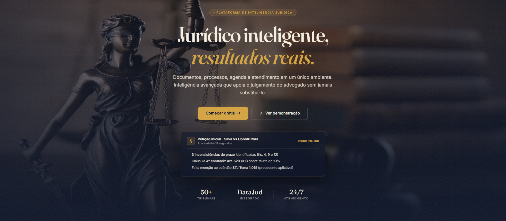
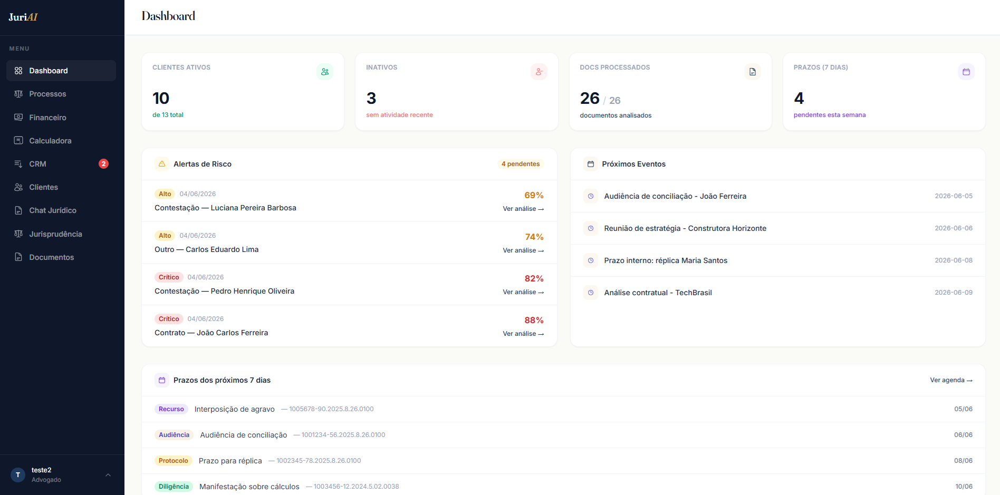
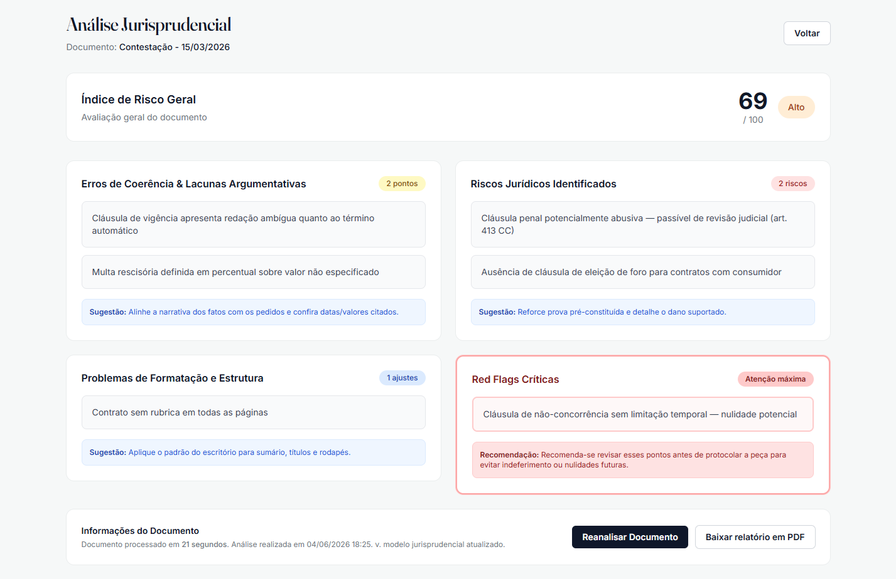
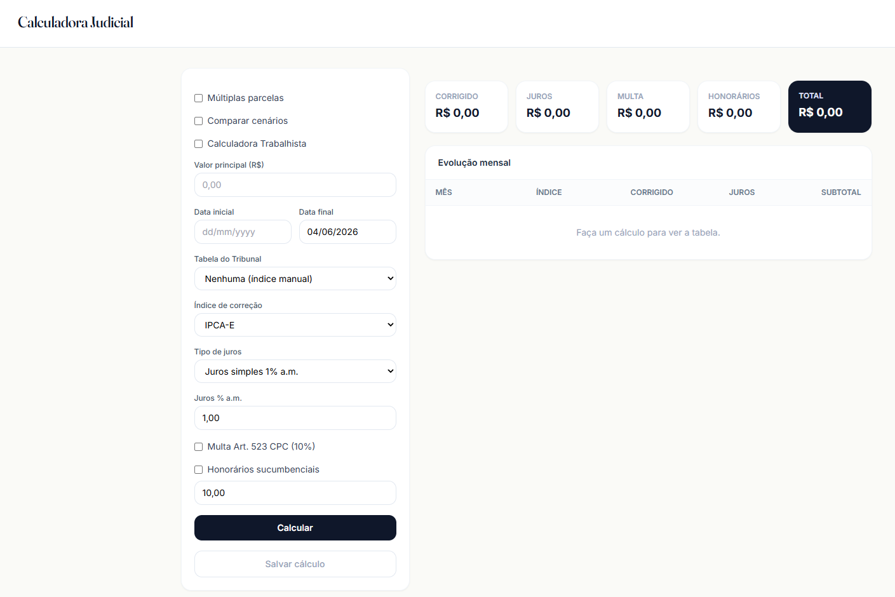

# JuriAI

**Portuguese version:** [README.pt-BR.md](README.pt-BR.md)

JuriAI is a legal SaaS platform for Brazilian solo lawyers and small law firms. It combines legal operations, client management, financial control, document automation, judicial calculations, and AI agents in a single Django application.

The goal is simple: help lawyers spend less time on repetitive operational work and more time on legal strategy, client relationships, and business growth.

## Product Preview

**Landing page**

**Operational dashboard**

| Jurisprudential risk analysis | Judicial calculator |
|---|---|
|  |  |

## Key Features

- **Client and case management**: clients, lawsuits, deadlines, procedural events, documents, and legal analyses in one workspace.
- **AI legal chat with RAG**: ask questions over a client's documents with per-client vector filtering.
- **Document risk analysis**: review petitions and contracts with a structured risk score, red flags, coherence issues, and formatting problems.
- **AI document drafting**: generate legal drafts from templates, client data, case data, and lawyer instructions.
- **WhatsApp intake and CRM**: automate first contact, create leads, manage pipeline stages, and convert leads into clients.
- **Deadlines and agenda**: manage legal deadlines, Google Calendar events, and email reminders.
- **Financial management**: fees, payments, overdue receivables, cash-flow reports, PDF and Excel exports.
- **Judicial calculator**: monetary correction, interest, court-specific tables, labor calculations, multiple installments, and scenario comparison.
- **LGPD-oriented workflows**: consent tracking, privacy/terms pages, account deletion, audit logs, and encrypted third-party API credentials.

## AI Agents

| Agent | Stack | Purpose |
|---|---|---|
| **JuriAI** | Agno + LanceDB RAG | Legal Q&A over client documents and DataJud/CNJ process lookup |
| **SecretariaAI** | Agno + Evolution API + Google Calendar | WhatsApp assistant for client intake, scheduling, and lead creation |
| **JurisprudenciaAI** | LangChain + OpenAI | Structured risk analysis for legal documents |
| **RedacaoAI** | Agno + OpenAI | AI-assisted drafting from legal templates and case context |

## Integrations

- **OpenAI** for AI agents and embeddings
- **LanceDB** for local vector search and client-scoped RAG
- **Evolution API** for WhatsApp automation
- **Google Calendar** for scheduling
- **CNJ DataJud** for Brazilian judicial process data
- **PostgreSQL** for production data storage
- **SMTP** for deadline and financial alerts
- **ReportLab, OpenPyXL, and python-docx** for PDF, Excel, and DOCX exports

## Tech Stack

- **Backend**: Django 6, Python 3.13
- **Database**: PostgreSQL in production, environment-configurable local database
- **Async tasks**: django-q
- **AI orchestration**: Agno, LangChain
- **Vector database**: LanceDB
- **Document processing**: Docling
- **Frontend**: Django templates + Tailwind CDN
- **Security and audit**: django-axes, django-auditlog, encrypted fields

## License

This project is proprietary and all rights are reserved. See [LICENSE](LICENSE).

No permission is granted to copy, modify, distribute, sublicense, or create derivative works without prior written authorization from the copyright holder.
