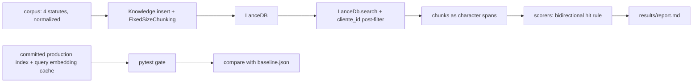

# Groundtruth

**Portuguese version:** [README.pt-br.md](README.pt-br.md)

Retrieval and generation evaluation for JuriAI's RAG over 4 public Brazilian statutes and 59 questions selected by two-model consensus. The best configurations reach recall@10 of 0.966 (hybrid search and reranker, tied) against 0.915 for the current production settings.

## Results

### Retrieval

Five configurations run over the same 59 golden questions. `production` is the configuration JuriAI runs today (`ia/retrieval_config.py`).

| config | chunk size/overlap | search type | reranker | n_chunks |
|---|---|---|---|---|
| production | 5000/0 | vector | none | 285 |
| chunk1500 | 1500/150 | vector | none | 1054 |
| chunk800 | 800/100 | vector | none | 2035 |
| hybrid | 1500/150 | hybrid | none | 1054 |
| rerank | 1500/150 | vector | bge-reranker-v2-m3 | 1054 |

Source: `results/notes.md`, section 2.

All 59 questions:

| config | recall@1 | recall@5 | recall@10 | mrr | ndcg@10 | p50 search ms |
|---|---|---|---|---|---|---|
| chunk1500 | 0.712 | 0.932 | 0.932 | 0.811 | 0.842 | 14 |
| chunk800 | 0.627 | 0.898 | 0.915 | 0.729 | 0.775 | 16 |
| hybrid | 0.695 | 0.949 | 0.966 | 0.806 | 0.847 | 17 |
| production | 0.373 | 0.864 | 0.915 | 0.594 | 0.675 | 12 |
| rerank | 0.881 | 0.966 | 0.966 | 0.921 | 0.933 | 45356 |

p50 search ms: wall-clock time inside retriever.search with the query embedding already computed, on the machine that ran it; informational, not gated.

Source: `results/report.md`.

no-leakage subset (spec): no judge rated leakage heavy and the longest copied run is under 5 tokens

| config | n | recall@1 | recall@5 | recall@10 | mrr | ndcg@10 |
|---|---|---|---|---|---|---|
| chunk1500 | 20 | 0.650 | 0.900 | 0.900 | 0.742 | 0.781 |
| chunk800 | 20 | 0.650 | 0.900 | 0.900 | 0.729 | 0.771 |
| hybrid | 20 | 0.500 | 0.900 | 0.900 | 0.667 | 0.726 |
| production | 20 | 0.400 | 0.750 | 0.750 | 0.575 | 0.621 |
| rerank | 20 | 0.750 | 0.900 | 0.900 | 0.817 | 0.838 |

Source: `results/report.md`.

short-copy subset (robustness view): the longest copied run is under 5 tokens; judge leakage labels are ignored

| config | n | recall@1 | recall@5 | recall@10 | mrr | ndcg@10 |
|---|---|---|---|---|---|---|
| chunk1500 | 49 | 0.694 | 0.918 | 0.918 | 0.793 | 0.825 |
| chunk800 | 49 | 0.612 | 0.898 | 0.918 | 0.720 | 0.769 |
| hybrid | 49 | 0.673 | 0.939 | 0.959 | 0.787 | 0.831 |
| production | 49 | 0.388 | 0.837 | 0.898 | 0.600 | 0.675 |
| rerank | 49 | 0.878 | 0.959 | 0.959 | 0.915 | 0.926 |

Source: `results/report.md`.

recall@10 by category

| config | conceito | fato_pontual | procedimento |
|---|---|---|---|
| chunk1500 | 0.818 (n=11) | 0.944 (n=18) | 0.967 (n=30) |
| chunk800 | 0.727 (n=11) | 0.944 (n=18) | 0.967 (n=30) |
| hybrid | 0.909 (n=11) | 0.944 (n=18) | 1.000 (n=30) |
| production | 0.909 (n=11) | 0.944 (n=18) | 0.900 (n=30) |
| rerank | 0.909 (n=11) | 0.944 (n=18) | 1.000 (n=30) |

Source: `results/report.md`.

On the full set, rerank has the highest recall@1 (0.881), recall@5 (0.966), MRR (0.921) and nDCG@10 (0.933), and ties with hybrid on recall@10 (0.966). On the no-leakage subset, chunk1500, chunk800, hybrid and rerank tie on recall@10 (0.900), all above production (0.750). The reranker's gain costs latency: p50 search rises from 14 ms to 45356 ms (see [What did not work](#what-did-not-work-and-findings)). Source: `results/notes.md`, sections 3 and 5.

See `results/significance.md` for the pre-registered bootstrap intervals and paired tests: chunk1500's recall@1 and MRR gains over production are significant after Holm correction (Holm p=0.0004 and 0.0010), but its recall@10 gain is not (Holm p=1.0000); hybrid's recall@10 gain over chunk1500 is not significant (Holm p=1.0000); rerank's MRR gain over chunk1500 is significant (Holm p=0.0216), but its recall@1 gain is not, after Holm correction (Holm p=0.0638).

### Generation

The real JuriAI agent (gpt-4o, production retrieval config) answered a sample of 30 golden questions (seed 7) and 10 out-of-scope questions. Faithfulness and answer relevancy are scored by DeepEval with gpt-4.1-mini as the judge model.

| category | faithfulness mean | faithfulness n | relevancy mean | relevancy n |
|---|---|---|---|---|
| conceito | 0.959 | 7 | 0.972 | 8 |
| fato_pontual | 0.969 | 8 | 1.000 | 8 |
| procedimento | 0.939 | 14 | 0.980 | 14 |
| overall | 0.952 | 29 | 0.983 | 30 |

No retrieval, excluded from the faithfulness mean: 1. Run failed, excluded from both means: 0.

Source: `results/generation.md`.

Abstention on the out-of-scope questions, judged by gpt-4.1 and claude-haiku-4-5:

| label | count |
|---|---|
| abstained | 0 of 7 completed runs |
| answered | 7 of 7 completed runs |
| disagreement | 0 of 7 completed runs |
| unverified | 0 of 7 completed runs |
| run failed | 3 of 10 out-of-scope questions |

Source: `results/generation.md`.

Failed runs:

| id | limit | requested |
|---|---|---|
| oos-01 | 30000 | 40540 |
| oos-07 | 30000 | 40571 |
| oos-08 | 30000 | 39229 |

Source: `results/generation.md`.

Answers that searched the knowledge base: 36 of 40. Measured cost of the generation run: $1.8735 in total, excluding agno's background memory-update calls. Source: `results/generation.md`.

## Recommendation

**Recommend chunk1500 dense as the measured default.** Against production, chunk1500 raises recall@1 from 0.373 to 0.712 and MRR from 0.594 to 0.811; `results/significance.md` finds both gaps significant after Holm correction (recall@1: b=23, c=3, Holm p=0.0004; MRR difference 0.216 [0.119, 0.314], Holm p=0.0010). The recall@10 gain, 0.915 to 0.932, is not significant (b=3, c=2, Holm p=1.0000). chunk1500 costs a little more than production: p50 search rises from 12 ms to 14 ms, the index grows from 285 to 1054 chunks, and ingestion rises from 434515 to 483330 tokens ($0.00869 to $0.00967). Source: `results/notes.md`, sections 2 and 4.

**Hybrid** is an option when recall@10 matters more than the first result. Against chunk1500, `results/significance.md` finds the full-set recall@10 gain (0.932 to 0.966, b=2, c=0) not significant after Holm correction (Holm p=1.0000), and neither the recall@1 nor the MRR change is significant either. On the no-leakage subset, hybrid lowers recall@1 (0.650 to 0.500) and MRR (0.742 to 0.667) against chunk1500, though neither drop is significant at n=20 (Holm p=1.0000 and 0.8888).

**Rerank** has the best ranking numbers on the full set (recall@1 0.881, MRR 0.921), and its MRR gain over chunk1500 is significant (difference 0.110 [0.035, 0.192], Holm p=0.0216); its recall@1 gain is not significant after Holm correction (Holm p=0.0638). It is not a candidate until the per-call model reload is fixed: p50 search is 45356 ms, because agno 2.4.7 reloads `BAAI/bge-reranker-v2-m3` from disk on every call (see [What did not work](#what-did-not-work-and-findings)).

**Adoption cost.** Changing `CHUNK_SIZE` means rebuilding the committed index and baseline and reindexing every stored document. Production's `render.yaml` sets `DATA_DIR=/tmp/juri-ai` (lines 17 and 18), so the LanceDB index lives on ephemeral storage today.

**Transfer caveat.** The comparison ran on 4 public statutes, while production documents are petitions and contracts passed through OCR. The gain is measured on this corpus only.

**Status.** This is a measured recommendation, not a deployed change.

## How it works



The indexer (`indexer.py`) inserts the corpus through the same agno path production uses. The retriever (`retriever.py`) calls the same `LanceDb.search`, maps each returned chunk back to a `[start, end)` character span in the normalized statute text, and the scorers (`scorers.py`) compare those spans with the golden passages.

## Golden set

### How the 59 questions were chosen

1. `golden/candidates.py` sampled 80 statute articles (cpc 30, clt 25, cdc 15, lgpd 10) and asked gpt-4.1-mini for one lawyer-style question per article.
2. `golden/triage.py` computed deterministic leakage signals and found competitor articles by two methods independent of the system under test: BM25 and text-embedding-3-large, top 5 each.
3. `golden/judges.py` ran two judges from different vendors, gpt-4.1 and claude-haiku-4-5, on the same evidence with rubric v2. Each judge is blind to the other and to the stored category.
4. `golden/consensus.py` admits a candidate only when both judges say the article alone fully answers the question, no judge names a competitor that fully answers it, the question cites no source, and both verdicts exist. The category is the majority of the generator and the two judges. Leakage never excludes; it is recorded.

Candidates: 80. Included: 59. Excluded: 21. There was no human legal review.

| exclusion reason | candidates |
|---|---|
| also_answered_by | 16 |
| answerable | 4 |
| category_no_majority | 4 |
| cites_source | 1 |
| judge_missing | 2 |

A candidate can have more than one reason.

| category | items |
|---|---|
| conceito | 11 |
| fato_pontual | 18 |
| procedimento | 30 |

No-leakage subset: 20 of 59 items, where no judge rated leakage heavy and the longest copied run is under 5 tokens.

Source: `results/golden_consensus.md`.

### Agreement between judges

| field | n | agreement | Cohen's kappa |
|---|---|---|---|
| answerable | 78 | 0.962 | 0.381 |
| also answered by any | 78 | 0.833 | 0.199 |
| leakage | 78 | 0.282 | -0.077 |
| category | 78 | 0.692 | 0.468 |

Source: `results/golden_consensus.md`.

The judges disagree on leakage at worse than chance (kappa -0.077). That disagreement is why two subsets are reported: the no-leakage subset uses both judges' labels, and the short-copy subset ignores them.

### Out-of-scope questions

The generation layer also uses 10 out-of-scope questions. `generation/out_of_scope_check.py` shows each question to gpt-4.1 and claude-haiku-4-5 together with the union of its BM25 top 5 and text-embedding-3-large top 5 articles. A question counts as out of scope only when both judges agree that none of those articles contains any part of the answer. The first run flagged oos-05 and oos-07 as answerable; those two questions were replaced, keeping their ids, and the re-run found 10 of 10 out of scope. Sources: `results/out_of_scope_check.md` and commit `c452ab4`.

## Design decisions

**(a) Passages are character spans, not chunk ids.** A golden passage is a `[start, end)` range in the normalized statute text, so any chunking or vector store can be scored against the same golden set. What it cost: the original hit rule (a chunk must cover 50% of a passage) meant a chunk shorter than half a passage could never hit it. Under that rule chunk800 could reach only 53 of 59 golden passages, and 17 of the 20 no-leakage passages. The rule became bidirectional before the chunk comparison: a chunk also hits when at least 50% of the chunk lies inside the passage. Production metrics are identical under both rules. Source: `results/notes.md`, section 1.

**(b) CI runs offline.** The production LanceDB index and the query embedding cache are committed, so the gate runs agno's real search path with no API key. What it cost: any change to chunking, embedder or corpus makes the committed index stale, and the gate fails until someone rebuilds the index and baseline locally with `OPENAI_API_KEY` and commits them.

**(c) Own scorers for retrieval, DeepEval for generation.** recall@k, MRR and nDCG@10 are computed by `scorers.py` over character spans. DeepEval is used only for the generation layer (faithfulness and answer relevancy).

**(d) Two leakage subsets.** The no-leakage subset follows the design spec: no judge rated leakage heavy and the longest copied run is under 5 tokens. The short-copy subset keeps only the copied-run condition, as a robustness view that does not depend on the judges' leakage labels.

## What did not work, and findings

- **5 questions have recall@10 = 0 under production**; 3 of them are recovered by every other config, 2 are not recovered by any config. Source: `results/failures.md`.
  - `r1-clt-041` [procedimento] "Como é calculado o pagamento mensal dos professores com base nas aulas semanais e nas faltas?" CLT Art. 320, passage length 562 characters. Cause not established. Recovered by chunk1500 (rank 1), chunk800 (rank 2), hybrid (rank 1) and rerank (rank 1).
  - `r1-clt-044` [procedimento] "Os municípios podem criar regras que contrariem as normas e instruções federais sobre o funcionamento dessas atividades?" CLT Art. 69, passage length 416 characters. Cause not established. Recovered by chunk1500 (rank 4), chunk800 (rank 1), hybrid (rank 2) and rerank (rank 1).
  - `r1-cpc-000` [procedimento] "Quais são os requisitos para que a eleição de foro tenha validade em um contrato?" CPC Art. 63, passage length 1361 characters. Cause not established. Recovered by chunk1500 (rank 1), chunk800 (rank 1), hybrid (rank 2) and rerank (rank 1).
  - `r1-cpc-016` [conceito] "Quais são as defesas que podem ser apresentadas nesse tipo de processo?" The question has no antecedent for "esse tipo de processo". In the generation run the agent asked for clarification without searching, which `results/generation.md` counts as the one no-retrieval answer. Not recovered: miss under production, chunk1500, chunk800, hybrid and rerank.
  - `r1-cpc-004` [fato_pontual] "Quando a desistência da ação passa a ter efeito legal?" The golden passage is CPC Art. 200, whose parágrafo único says the desistência takes effect only after judicial homologation. None of the 10 chunks hybrid returns overlaps that passage; 4 of them contain the word "desistência" from other provisions, including CPC Art. 485 and Art. 1.040. Not recovered: miss under production, chunk1500, chunk800, hybrid and rerank.
- **The `cliente_id` filter runs after top-k, and it shows.** agno 2.4.7's `LanceDb.search` asks LanceDB for `limit` rows and nothing else (`agno/vectordb/lancedb/lance_db.py:474-483`), then drops in Python the rows whose `meta_data` does not match the filter (`lance_db.py:486-503`); filter expressions are refused with a warning (`lance_db.py:467-469`). Measured on a two-tenant table built offline from the same corpus and production chunking (tenant 0 owns cdc and clt, 149 chunks; tenant 1 owns cpc and lgpd, 136 chunks; 285 in total), with `limit=10`:
  - Searched for the tenant that owns the question's document, 26 of 59 questions got fewer than 10 rows (12 of 28 for tenant 0, mean 8.54 rows; 14 of 31 for tenant 1, mean 9.19) and none got 0. recall@10 did not move: 0.929 and 0.903, the same as the single-tenant index on the same questions.
  - Searched for the tenant that does not own it, all 59 got fewer than 10 rows and 33 got 0 (17 of 31 for tenant 0, 16 of 28 for tenant 1), although each tenant holds more than 130 chunks.
  - Rows any search returned for the wrong tenant: 0. The filter has not leaked data between tenants in any of the 236 searches (59 questions, both tenants, with and without over-fetching).
  - The harness retriever now over-fetches: `LanceDbRetriever` asks agno for `k * OVERFETCH_FACTOR` rows (factor 10), keeps the first k that survive the filter, and records the shortfall (`last_shortfall`) instead of retrying. With it, the owning tenant got 10 rows on all 59 questions; the non-owning search got 10 rows on all 31 questions for tenant 0, and tenant 1 still came up short on 10 of 28 (mean 8.18). This is a mitigation in the harness, not a fix in the app: `ia/` is unchanged, and over-fetching only lowers the chance of a short result set, since a tenant with very little data can still come up short. It applies to plain vector search only; the hybrid and rerank paths keep their candidate counts, because a longer cut changes their order, and the single-tenant numbers in `results/report.md` are unchanged.
  - A real pre-filter needs `cliente_id` as a column the vector search can filter on. agno's table has only `vector`, `id` and `payload` (`lance_db.py:236-251`), with `cliente_id` inside the `payload` JSON string, so it needs a change in agno or a custom vector store.
  - agno's `Knowledge.insert` catches an embedding error, logs it and inserts 0 chunks for that document (`agno/knowledge/knowledge.py:3899-3905`), so the offline build checks each document's chunk count instead of relying on an exception. Source: `results/multitenant.md`.
- **Hybrid full-text search has no Portuguese stemming.** It runs over the `payload` column with agno's native LanceDB FTS (`use_tantivy=False`). On the no-leakage subset, hybrid lowers recall@1 (0.500 vs 0.650) and MRR (0.667 vs 0.742) against dense chunk1500. Source: `results/notes.md`, sections 5 and 6.
- **The reranker reloads its model on every call.** agno 2.4.7's `SentenceTransformerReranker._rerank` constructs a new `CrossEncoder` per call, so every timed rerank search includes loading `BAAI/bge-reranker-v2-m3` from disk. p50 search is 45356 ms. It was measured as is, not patched. Source: `results/notes.md`, section 7.
- **The agent abstained on 0 of 7 completed out-of-scope runs.** It answers from general knowledge, and its instructions do not ask it to abstain on an out-of-scope question. Source: `results/generation.md`.
- **3 of 10 out-of-scope runs failed on rate limits.** A single agent turn with the production retrieval config (5000-character chunks, 10 results per search) requested 39229 to 40571 tokens, above a Tier 1 OpenAI account's 30,000 gpt-4o tokens-per-minute limit. Source: `results/generation.md`.
- **The first CI runs failed before any job started.** The workflow used `${{ runner.temp }}` in job-level `env`, where GitHub does not allow the `runner` context ("Invalid workflow file: Unrecognized named-value: 'runner'"). PR #11 fixed it by moving `DATA_DIR` into the test step's env.
- **pandas was an undeclared dependency.** A clean-venv CI simulation found that agno 2.4.7 `LanceDb` search calls `to_pandas()`, while pandas was installed only through docling, which the CI install excludes. `pandas==2.3.3` is now declared in `requirements.txt`.

## CI regression gate

The workflow [`.github/workflows/groundtruth.yml`](../../.github/workflows/groundtruth.yml) runs on every pull request, on pushes to main, and on manual dispatch. It installs the app dependencies without the OCR stack plus `evals/groundtruth/requirements.txt`, then runs `python -m pytest evals/groundtruth/tests -q -m "not needs_api"`, with no API key. Three tests in [`tests/test_gate.py`](tests/test_gate.py) form the `retrieval-gate` job:

- `test_production_index_matches_current_retrieval_config`: the committed index fingerprint must match the production config.
- `test_production_recall_at_10_does_not_regress`: the production config runs over the golden set offline, and recall@10 must not drop more than 0.01 below [`baseline.json`](baseline.json) (0.9152542372881356). A stale query cache, a stale index or a changed golden set size also fails the test, with the local rebuild command in the message.
- `test_production_mrr_does_not_regress`: the same offline run, shared with the recall@10 test, and mrr must not drop more than 0.02 below `baseline.json` (0.5944175410277106). The tolerance is wider than recall@10's because a single golden question moving from hit to miss shifts mrr by up to 1/59 (about 0.017); the gate exists to catch real regressions, not that noise. A baseline written before this key existed fails with a message naming the rebuild command, not a `KeyError`.

**Demo.** [PR #12](https://github.com/yagosamu/juri_ai/pull/12) deliberately changed `MAX_RESULTS` from 10 to 3. The check failed with 2 failed and 175 passed tests: `test_production_recall_at_10_does_not_regress` with "recall@10 dropped from 0.915 to 0.780 (max drop 0.01)", and `test_production_config::test_constants_match_agno_defaults_documented_in_spec` with "assert 3 == 10". The PR was closed without merge. The same change now also fails `test_production_mrr_does_not_regress` with "mrr dropped from 0.594 to 0.568 (max drop 0.02)".


**What the gate does not stop.** A second workflow, [`.github/workflows/groundtruth-baseline-label.yml`](../../.github/workflows/groundtruth-baseline-label.yml), runs the `baseline-change` job on every pull request and again whenever a label is added or removed, and fails when a protected path (`baseline.json`, `golden/golden_set.jsonl`, `indexes/**` or `cache/queries/**`) changed without the `baseline-change` label, naming the changed files and asking a maintainer to review the numbers before adding the label. So a pull request that edits `baseline.json` together with a regression, or changes the golden set and the baseline together, now fails unless a maintainer adds that label. In a single-maintainer repository this is a speed bump, not an authorization control: the same person proposing the change can also add the label, so it only guarantees a deliberate second look, not review by someone else. The gate still checks only the production config's recall@10 and mrr; recall@1, nDCG and the other configs are not gated.

## Observability


Langfuse traces of real JuriAI answers from the Groundtruth run on 2026-09-16. Prompt and completion content is redacted by the production masking hook.

Production tracing (`ia/observability.py`, called by `ensure_agno_tracing()` in `ia/views.py`) was switched on for 3 golden questions: r1-clt-045, r1-cdc-062 and r1-lgpd-071.

- Each agent run appeared as an `Assistente_Jurídico_Virtual.run` trace with an agent span, a small gpt-4o call deciding to search (about 470 input tokens), the `search_knowledge_base` tool span, and a gpt-4o answer call with the retrieved context (11,825 to 14,833 input tokens).
- Latency was 8.55 to 9.14 s per run. Langfuse-computed cost was $0.0343 to $0.0393 per run.
- agno's background memory-update calls appeared as separate `OpenAIChat.invoke` traces of about 900 input tokens, costing $0.0031 to $0.0047 each. Langfuse shows these calls, which `run.metrics` does not meter, so the measured cost in `results/generation.md` excludes them.
- Every trace and observation input and output shows `[REDACTED]` from the closed-allowlist masking hook.

## Reproduce

Run every command from the repository root. Commands are taken from each module's docstring and argparse definition.

### Install

```bash
pip install -r requirements.txt -r evals/groundtruth/requirements.txt
pip install -r evals/groundtruth/requirements-local.txt   # local only: sentence-transformers, deepeval, anthropic
```

CI installs `requirements.txt` without `docling` and `mpire`, plus `evals/groundtruth/requirements.txt`. DeepEval runs with `DEEPEVAL_TELEMETRY_OPT_OUT=1`, which `generation/scoring.py` sets before importing it.

### Environment variables

- `OPENAI_API_KEY`: embeddings, question generation, gpt-4.1 judge, the agent and DeepEval.
- `ANTHROPIC_API_KEY`: the claude-haiku-4-5 judge.
- Optional, for Langfuse tracing: `LANGFUSE_ENABLED`, `LANGFUSE_PUBLIC_KEY`, `LANGFUSE_SECRET_KEY`, `LANGFUSE_BASE_URL`.

### Commands

"Paid API" marks commands that call OpenAI or Anthropic.

| step | command | paid API |
|---|---|---|
| Corpus: download from Planalto and normalize | `.venv/Scripts/python.exe -m evals.groundtruth.corpus.build_corpus` | no |
| Corpus: normalize from `corpus/raw` without downloading | `.venv/Scripts/python.exe -m evals.groundtruth.corpus.build_corpus --from-raw` | no |
| Index: production (committed; rebuild only after a config or corpus change) | `.venv/Scripts/python.exe -m evals.groundtruth.indexer --config production` | yes, embeddings |
| Index: comparison configs (hybrid and rerank reuse the chunk1500 index) | `.venv/Scripts/python.exe -m evals.groundtruth.indexer --config chunk1500` and `--config chunk800` | yes, embeddings |
| Retrieval run from the committed query cache | `.venv/Scripts/python.exe -m evals.groundtruth.run_retrieval --config production chunk1500 chunk800 hybrid rerank --offline` | no |
| Retrieval run and new baseline | `.venv/Scripts/python.exe -m evals.groundtruth.run_retrieval --config production --write-baseline` | only on a query cache miss |
| Report | `.venv/Scripts/python.exe -m evals.groundtruth.report` | no |
| Gate and offline tests | `.venv/Scripts/python.exe -m pytest evals/groundtruth/tests -q -m "not needs_api"` | no |
| Golden set: candidates | `.venv/Scripts/python.exe -m evals.groundtruth.golden.candidates --round 1` | yes, gpt-4.1-mini |
| Golden set: triage | `.venv/Scripts/python.exe -m evals.groundtruth.golden.triage` (`--smoke`, `--limit N`, `--force`) | yes, gpt-4.1 and text-embedding-3-large |
| Golden set: recompute triage flags from stored verdicts | `.venv/Scripts/python.exe -m evals.groundtruth.golden.triage --rederive-flags` | no |
| Golden set: judges | `.venv/Scripts/python.exe -m evals.groundtruth.golden.judges` (`--smoke`, `--limit N`) | yes, gpt-4.1 and claude-haiku-4-5 |
| Golden set: consensus | `.venv/Scripts/python.exe -m evals.groundtruth.golden.consensus` | no |
| Out-of-scope check | `.venv/Scripts/python.exe -m evals.groundtruth.generation.out_of_scope_check` | yes, text-embedding-3-large, gpt-4.1 and claude-haiku-4-5 |
| Generation: smoke run, one question of each kind, written only under `runtime/generation` | `.venv/Scripts/python.exe -m evals.groundtruth.generation.run_generation --smoke --limit-golden 1 --limit-oos 1` | yes |
| Generation: full run | `.venv/Scripts/python.exe -m evals.groundtruth.generation.run_generation` | yes, gpt-4o, gpt-4.1-mini, gpt-4.1 and claude-haiku-4-5 |
| Generation: rebuild `results/generation.md` from stored answers and scores | `.venv/Scripts/python.exe -m evals.groundtruth.generation.run_generation --report-only` | no |
| Generation: rerun failed runs only | `.venv/Scripts/python.exe -m evals.groundtruth.generation.run_generation --only oos-01 oos-07 oos-08` | yes |

Notes:
- The indexer's `--offline` flag fails on an embedding cache miss instead of calling the API. `cache/chunks` is not committed, so a rebuild from a clean clone calls the embeddings API.
- The rerank config downloads `BAAI/bge-reranker-v2-m3` from Hugging Face on first use.
- `--only` refuses any id that is not currently a failed run.
- `golden/candidates.jsonl`, `golden/triage.jsonl`, `golden/judgments.jsonl` and `golden/golden_set.jsonl` are committed, so triage, judges and consensus can be rerun from a clone against the published candidates. Regenerating candidates calls gpt-4.1-mini at temperature 0.7, so new candidates would differ from the published set.

## Disclosure

- The benchmark measures the published pipeline over a public corpus, not the law office's traffic.
- The golden set has no human legal review. It was selected by consensus of two LLM judges, gpt-4.1 and claude-haiku-4-5.
- The 59-question set is below the design target of 100.
- The generation layer uses a sample of 30 golden questions drawn with seed 7, and both of its scorers are LLM judges.
- Measured costs are listed in `results/notes.md` (ingestion) and `results/generation.md` (generation).
