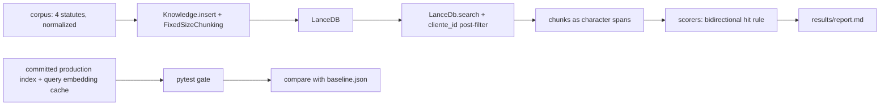
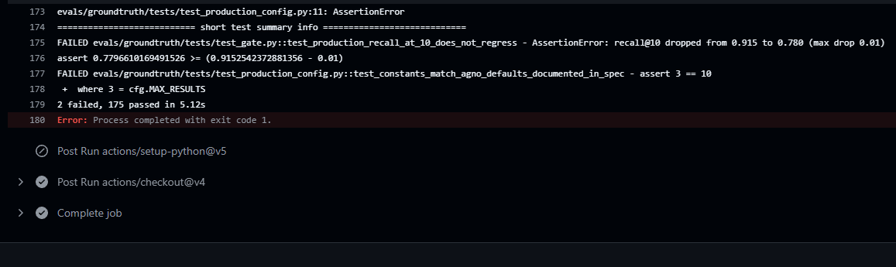
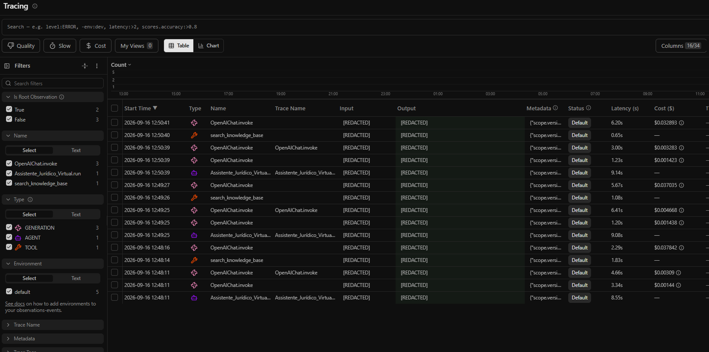
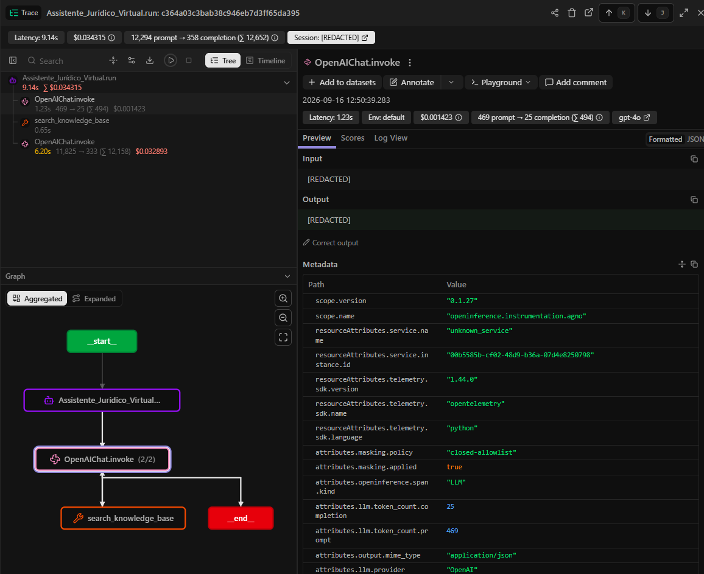

# Groundtruth

**English version:** [README.md](README.md)

Avaliação de retrieval e de geração do RAG do JuriAI sobre 4 leis brasileiras públicas e 59 perguntas selecionadas por consenso de dois modelos. As melhores configurações chegam a recall@10 de 0.966 (busca híbrida e reranker, empatados), contra 0.915 da configuração atual de produção.

## Resultados

### Retrieval

Cinco configurações rodam sobre as mesmas 59 perguntas do golden set. `production` é a configuração que o JuriAI usa hoje (`ia/retrieval_config.py`).

| config | chunk size/overlap | search type | reranker | n_chunks |
|---|---|---|---|---|
| production | 5000/0 | vector | none | 285 |
| chunk1500 | 1500/150 | vector | none | 1054 |
| chunk800 | 800/100 | vector | none | 2035 |
| hybrid | 1500/150 | hybrid | none | 1054 |
| rerank | 1500/150 | vector | bge-reranker-v2-m3 | 1054 |

Fonte: `results/notes.md`, seção 2.

Todas as 59 perguntas:

| config | recall@1 | recall@5 | recall@10 | mrr | ndcg@10 | p50 search ms |
|---|---|---|---|---|---|---|
| chunk1500 | 0.712 | 0.932 | 0.932 | 0.811 | 0.842 | 14 |
| chunk800 | 0.627 | 0.898 | 0.915 | 0.729 | 0.775 | 16 |
| hybrid | 0.695 | 0.949 | 0.966 | 0.806 | 0.847 | 17 |
| production | 0.373 | 0.864 | 0.915 | 0.594 | 0.675 | 12 |
| rerank | 0.881 | 0.966 | 0.966 | 0.921 | 0.933 | 45356 |

p50 search ms: tempo de relógio dentro de retriever.search, com o embedding da pergunta já calculado, na máquina que rodou; informativo, fora do gate.

Fonte: `results/report.md`.

subconjunto sem vazamento (spec): nenhum juiz classificou o vazamento como heavy e a maior sequência copiada tem menos de 5 tokens

| config | n | recall@1 | recall@5 | recall@10 | mrr | ndcg@10 |
|---|---|---|---|---|---|---|
| chunk1500 | 20 | 0.650 | 0.900 | 0.900 | 0.742 | 0.781 |
| chunk800 | 20 | 0.650 | 0.900 | 0.900 | 0.729 | 0.771 |
| hybrid | 20 | 0.500 | 0.900 | 0.900 | 0.667 | 0.726 |
| production | 20 | 0.400 | 0.750 | 0.750 | 0.575 | 0.621 |
| rerank | 20 | 0.750 | 0.900 | 0.900 | 0.817 | 0.838 |

Fonte: `results/report.md`.

subconjunto de cópia curta (visão de robustez): a maior sequência copiada tem menos de 5 tokens; os rótulos de vazamento dos juízes são ignorados

| config | n | recall@1 | recall@5 | recall@10 | mrr | ndcg@10 |
|---|---|---|---|---|---|---|
| chunk1500 | 49 | 0.694 | 0.918 | 0.918 | 0.793 | 0.825 |
| chunk800 | 49 | 0.612 | 0.898 | 0.918 | 0.720 | 0.769 |
| hybrid | 49 | 0.673 | 0.939 | 0.959 | 0.787 | 0.831 |
| production | 49 | 0.388 | 0.837 | 0.898 | 0.600 | 0.675 |
| rerank | 49 | 0.878 | 0.959 | 0.959 | 0.915 | 0.926 |

Fonte: `results/report.md`.

recall@10 por categoria

| config | conceito | fato_pontual | procedimento |
|---|---|---|---|
| chunk1500 | 0.818 (n=11) | 0.944 (n=18) | 0.967 (n=30) |
| chunk800 | 0.727 (n=11) | 0.944 (n=18) | 0.967 (n=30) |
| hybrid | 0.909 (n=11) | 0.944 (n=18) | 1.000 (n=30) |
| production | 0.909 (n=11) | 0.944 (n=18) | 0.900 (n=30) |
| rerank | 0.909 (n=11) | 0.944 (n=18) | 1.000 (n=30) |

Fonte: `results/report.md`.

No conjunto inteiro, rerank tem o maior recall@1 (0.881), recall@5 (0.966), MRR (0.921) e nDCG@10 (0.933), e empata com hybrid em recall@10 (0.966). No subconjunto sem vazamento, chunk1500, chunk800, hybrid e rerank empatam em recall@10 (0.900), todos acima de production (0.750). O ganho do reranker custa latência: o p50 de busca sobe de 14 ms para 45356 ms (ver [O que não funcionou, e achados](#o-que-não-funcionou-e-achados)). Fonte: `results/notes.md`, seções 3 e 5.

### Geração

O agente JuriAI real (gpt-4o, config de retrieval de produção) respondeu a uma amostra de 30 perguntas do golden set (seed 7) e a 10 perguntas fora de escopo. Faithfulness e answer relevancy são pontuadas pelo DeepEval com gpt-4.1-mini como modelo juiz.

| category | faithfulness mean | faithfulness n | relevancy mean | relevancy n |
|---|---|---|---|---|
| conceito | 0.959 | 7 | 0.972 | 8 |
| fato_pontual | 0.969 | 8 | 1.000 | 8 |
| procedimento | 0.939 | 14 | 0.980 | 14 |
| overall | 0.952 | 29 | 0.983 | 30 |

Sem retrieval, excluída da média de faithfulness: 1. Execução com falha, excluída das duas médias: 0.

Fonte: `results/generation.md`.

Abstenção nas perguntas fora de escopo, julgada por gpt-4.1 e claude-haiku-4-5:

| rótulo | contagem |
|---|---|
| abstained | 0 de 7 execuções concluídas |
| answered | 7 de 7 execuções concluídas |
| disagreement | 0 de 7 execuções concluídas |
| unverified | 0 de 7 execuções concluídas |
| run failed | 3 de 10 perguntas fora de escopo |

Fonte: `results/generation.md`.

Execuções com falha:

| id | limit | requested |
|---|---|---|
| oos-01 | 30000 | 40540 |
| oos-07 | 30000 | 40571 |
| oos-08 | 30000 | 39229 |

Fonte: `results/generation.md`.

Respostas que buscaram na base de conhecimento: 36 de 40. Custo medido da execução de geração: $1.8735 no total, sem as chamadas de atualização de memória em segundo plano do agno. Fonte: `results/generation.md`.

## Como funciona



O indexador (`indexer.py`) insere o corpus pelo mesmo caminho do agno que a produção usa. O retriever (`retriever.py`) chama o mesmo `LanceDb.search`, converte cada chunk retornado em um intervalo de caracteres `[start, end)` no texto normalizado da lei, e os scorers (`scorers.py`) comparam esses intervalos com as passagens do golden set.

## Golden set

### Como as 59 perguntas foram escolhidas

1. `golden/candidates.py` sorteou 80 artigos de lei (cpc 30, clt 25, cdc 15, lgpd 10) e pediu ao gpt-4.1-mini uma pergunta de advogado por artigo.
2. `golden/triage.py` calculou sinais determinísticos de vazamento e encontrou artigos concorrentes por dois métodos independentes do sistema medido: BM25 e text-embedding-3-large, top 5 de cada.
3. `golden/judges.py` rodou dois juízes de fornecedores diferentes, gpt-4.1 e claude-haiku-4-5, sobre as mesmas evidências com a rubrica v2. Cada juiz é cego ao outro e à categoria gravada.
4. `golden/consensus.py` só admite um candidato quando os dois juízes dizem que o artigo, sozinho, responde a pergunta por completo, nenhum juiz aponta um concorrente que responda por completo, a pergunta não cita fonte e os dois vereditos existem. A categoria é a maioria entre o gerador e os dois juízes. Vazamento nunca exclui; é registrado.

Candidatos: 80. Incluídos: 59. Excluídos: 21. Não houve revisão jurídica humana.

| motivo de exclusão | candidatos |
|---|---|
| also_answered_by | 16 |
| answerable | 4 |
| category_no_majority | 4 |
| cites_source | 1 |
| judge_missing | 2 |

Um candidato pode ter mais de um motivo.

| categoria | itens |
|---|---|
| conceito | 11 |
| fato_pontual | 18 |
| procedimento | 30 |

Subconjunto sem vazamento: 20 de 59 itens, em que nenhum juiz classificou o vazamento como heavy e a maior sequência copiada tem menos de 5 tokens.

Fonte: `results/golden_consensus.md`.

### Concordância entre os juízes

| campo | n | concordância | kappa de Cohen |
|---|---|---|---|
| answerable | 78 | 0.962 | 0.381 |
| also answered by any | 78 | 0.833 | 0.199 |
| leakage | 78 | 0.282 | -0.077 |
| category | 78 | 0.692 | 0.468 |

Fonte: `results/golden_consensus.md`.

Os juízes discordam sobre vazamento em nível pior que o acaso (kappa -0.077). Essa discordância é o motivo de reportar dois subconjuntos: o subconjunto sem vazamento usa os rótulos dos dois juízes, e o de cópia curta os ignora.

### Perguntas fora de escopo

A camada de geração também usa 10 perguntas fora de escopo. `generation/out_of_scope_check.py` mostra cada pergunta ao gpt-4.1 e ao claude-haiku-4-5 junto com a união dos seus artigos top 5 por BM25 e top 5 por text-embedding-3-large. Uma pergunta só conta como fora de escopo quando os dois juízes concordam que nenhum desses artigos contém qualquer parte da resposta. A primeira execução marcou oos-05 e oos-07 como respondíveis; essas duas perguntas foram substituídas, mantendo os ids, e a nova execução encontrou 10 de 10 fora de escopo. Fontes: `results/out_of_scope_check.md` e o commit `c452ab4`.

## Decisões de design

**(a) Passagens são intervalos de caracteres, não ids de chunk.** Uma passagem do golden set é um intervalo `[start, end)` no texto normalizado da lei, então qualquer chunking ou banco vetorial pode ser avaliado contra o mesmo golden set. O que custou: a regra de acerto original (um chunk precisa cobrir 50% da passagem) fazia com que um chunk menor que metade da passagem nunca acertasse. Por essa regra, chunk800 alcançava só 53 das 59 passagens do golden set, e 17 das 20 passagens sem vazamento. A regra passou a ser bidirecional antes da comparação de chunks: um chunk também acerta quando pelo menos 50% do chunk está dentro da passagem. As métricas de produção são idênticas nas duas regras. Fonte: `results/notes.md`, seção 1.

**(b) O CI roda offline.** O índice LanceDB de produção e o cache de embeddings das perguntas estão versionados, então o gate roda o caminho real de busca do agno sem chave de API. O que custou: qualquer mudança de chunking, embedder ou corpus deixa o índice versionado defasado, e o gate falha até alguém reconstruir o índice e o baseline localmente com `OPENAI_API_KEY` e versioná-los.

**(c) Scorers próprios no retrieval, DeepEval na geração.** recall@k, MRR e nDCG@10 são calculados por `scorers.py` sobre intervalos de caracteres. O DeepEval é usado só na camada de geração (faithfulness e answer relevancy).

**(d) Dois subconjuntos de vazamento.** O subconjunto sem vazamento segue a spec de design: nenhum juiz classificou o vazamento como heavy e a maior sequência copiada tem menos de 5 tokens. O subconjunto de cópia curta mantém só a condição da sequência copiada, como visão de robustez que não depende dos rótulos de vazamento dos juízes.

## O que não funcionou, e achados

- **2 perguntas têm recall@10 = 0 na melhor config** (hybrid, empatada com rerank). Fonte: `results/report.md`.
  - `r1-cpc-016` [conceito] "Quais são as defesas que podem ser apresentadas nesse tipo de processo?" A pergunta não tem antecedente para "esse tipo de processo". Na execução de geração o agente pediu esclarecimento sem buscar, e `results/generation.md` conta isso como a única resposta sem retrieval.
  - `r1-cpc-004` [fato_pontual] "Quando a desistência da ação passa a ter efeito legal?" A passagem do golden set é o Art. 200 do CPC, cujo parágrafo único diz que a desistência só produz efeitos após homologação judicial. Nenhum dos 10 chunks que hybrid retorna se sobrepõe a essa passagem; 4 deles contêm a palavra "desistência" em outros dispositivos, entre eles os Arts. 485 e 1.040 do CPC. A pergunta tem recall@10 = 0 nas 5 configs. Causa não estabelecida.
- **O filtro `cliente_id` roda depois do top-k.** O `LanceDb.search` do agno 2.4.7 busca os primeiros resultados e só depois os filtra em Python, então um cliente com poucos dados pode receber menos de k resultados. Este benchmark tem um único cliente e não mediu isso.
- **A busca full-text do hybrid não tem stemming em português.** Ela roda sobre a coluna `payload` com o FTS nativo do LanceDB no agno (`use_tantivy=False`). No subconjunto sem vazamento, hybrid reduz recall@1 (0.500 vs 0.650) e MRR (0.667 vs 0.742) em relação ao chunk1500 denso. Fonte: `results/notes.md`, seções 5 e 6.
- **O reranker recarrega o modelo a cada chamada.** O `SentenceTransformerReranker._rerank` do agno 2.4.7 constrói um novo `CrossEncoder` por chamada, então cada busca cronometrada do rerank inclui carregar `BAAI/bge-reranker-v2-m3` do disco. O p50 de busca é 45356 ms. Foi medido assim, sem patch. Fonte: `results/notes.md`, seção 7.
- **O agente se absteve em 0 de 7 execuções fora de escopo concluídas.** Ele responde com conhecimento geral, e suas instruções não pedem abstenção em pergunta fora de escopo. Fonte: `results/generation.md`.
- **3 de 10 execuções fora de escopo falharam por limite de taxa.** Um único turno do agente com a config de retrieval de produção (chunks de 5000 caracteres, 10 resultados por busca) pediu de 39229 a 40571 tokens, acima do limite de 30,000 tokens por minuto de gpt-4o de uma conta OpenAI Tier 1. Fonte: `results/generation.md`.
- **As primeiras execuções do CI falharam antes de qualquer job começar.** O workflow usava `${{ runner.temp }}` no `env` do job, onde o GitHub não permite o contexto `runner` ("Invalid workflow file: Unrecognized named-value: 'runner'"). O PR #11 corrigiu isso movendo `DATA_DIR` para o env do step de teste.
- **pandas era uma dependência não declarada.** Uma simulação do CI em venv limpo mostrou que a busca do `LanceDb` no agno 2.4.7 chama `to_pandas()`, enquanto o pandas só era instalado via docling, que a instalação do CI exclui. `pandas==2.3.3` agora está declarado em `requirements.txt`.

## Gate de regressão no CI

O workflow [`.github/workflows/groundtruth.yml`](../../.github/workflows/groundtruth.yml) roda em todo pull request, em push para main e por disparo manual. Ele instala as dependências da aplicação sem a stack de OCR mais `evals/groundtruth/requirements.txt`, e então roda `python -m pytest evals/groundtruth/tests -q -m "not needs_api"`, sem chave de API. Dois testes em [`tests/test_gate.py`](tests/test_gate.py) formam o gate:

- `test_production_index_matches_current_retrieval_config`: o fingerprint do índice versionado precisa bater com a config de produção.
- `test_production_recall_at_10_does_not_regress`: a config de produção roda offline sobre o golden set, e o recall@10 não pode cair mais de 0.01 abaixo de [`baseline.json`](baseline.json) (0.9152542372881356). Cache de perguntas defasado, índice defasado ou golden set com tamanho alterado também reprovam o teste, com o comando de reconstrução local na mensagem.

**Demonstração.** O [PR #12](https://github.com/yagosamu/juri_ai/pull/12) mudou de propósito `MAX_RESULTS` de 10 para 3. O check falhou com 2 testes com falha e 175 aprovados: `test_production_recall_at_10_does_not_regress` com "recall@10 dropped from 0.915 to 0.780 (max drop 0.01)", e `test_production_config::test_constants_match_agno_defaults_documented_in_spec` com "assert 3 == 10". O PR foi fechado sem merge.



**O que o gate não impede.** Um PR que edita `baseline.json` junto com a regressão passa. Um PR que muda o golden set e o baseline juntos também passa. O gate só verifica o recall@10 da config de produção.

## Observabilidade





Traces do Langfuse de respostas reais do JuriAI, da execução do Groundtruth em 2026-09-16. O conteúdo de prompt e resposta é redigido pelo hook de masking de produção.

O tracing de produção (`ia/observability.py`, chamado por `ensure_agno_tracing()` em `ia/views.py`) foi ligado para 3 perguntas do golden set: r1-clt-045, r1-cdc-062 e r1-lgpd-071.

- Cada execução do agente apareceu como um trace `Assistente_Jurídico_Virtual.run` com um span de agente, uma chamada pequena ao gpt-4o que decide buscar (cerca de 470 tokens de entrada), o span da ferramenta `search_knowledge_base`, e uma chamada de resposta ao gpt-4o com o contexto recuperado (11,825 a 14,833 tokens de entrada).
- A latência foi de 8.55 a 9.14 s por execução. O custo calculado pelo Langfuse foi de $0.0343 a $0.0393 por execução.
- As chamadas de atualização de memória em segundo plano do agno apareceram como traces `OpenAIChat.invoke` separados, com cerca de 900 tokens de entrada, custando de $0.0031 a $0.0047 cada. O Langfuse mostra essas chamadas, que o `run.metrics` não mede, por isso o custo medido em `results/generation.md` não as inclui.
- Toda entrada e saída de trace e de observação mostra `[REDACTED]`, efeito do hook de masking por allowlist fechada.

## Como reproduzir

Rode todos os comandos a partir da raiz do repositório. Os comandos vêm da docstring e da definição de argparse de cada módulo.

### Instalação

```bash
pip install -r requirements.txt -r evals/groundtruth/requirements.txt
pip install -r evals/groundtruth/requirements-local.txt   # local only: sentence-transformers, deepeval, anthropic
```

O CI instala `requirements.txt` sem `docling` e `mpire`, mais `evals/groundtruth/requirements.txt`. O DeepEval roda com `DEEPEVAL_TELEMETRY_OPT_OUT=1`, que `generation/scoring.py` define antes de importá-lo.

### Variáveis de ambiente

- `OPENAI_API_KEY`: embeddings, geração de perguntas, juiz gpt-4.1, o agente e o DeepEval.
- `ANTHROPIC_API_KEY`: o juiz claude-haiku-4-5.
- Opcionais, para tracing no Langfuse: `LANGFUSE_ENABLED`, `LANGFUSE_PUBLIC_KEY`, `LANGFUSE_SECRET_KEY`, `LANGFUSE_BASE_URL`.

### Comandos

"API paga" marca os comandos que chamam a OpenAI ou a Anthropic.

| etapa | comando | API paga |
|---|---|---|
| Corpus: baixar do Planalto e normalizar | `.venv/Scripts/python.exe -m evals.groundtruth.corpus.build_corpus` | não |
| Corpus: normalizar a partir de `corpus/raw` sem baixar | `.venv/Scripts/python.exe -m evals.groundtruth.corpus.build_corpus --from-raw` | não |
| Índice: production (versionado; reconstruir só após mudança de config ou de corpus) | `.venv/Scripts/python.exe -m evals.groundtruth.indexer --config production` | sim, embeddings |
| Índice: configs de comparação (hybrid e rerank reusam o índice do chunk1500) | `.venv/Scripts/python.exe -m evals.groundtruth.indexer --config chunk1500` e `--config chunk800` | sim, embeddings |
| Execução de retrieval a partir do cache de perguntas versionado | `.venv/Scripts/python.exe -m evals.groundtruth.run_retrieval --config production chunk1500 chunk800 hybrid rerank --offline` | não |
| Execução de retrieval e novo baseline | `.venv/Scripts/python.exe -m evals.groundtruth.run_retrieval --config production --write-baseline` | só se faltar pergunta no cache |
| Relatório | `.venv/Scripts/python.exe -m evals.groundtruth.report` | não |
| Gate e testes offline | `.venv/Scripts/python.exe -m pytest evals/groundtruth/tests -q -m "not needs_api"` | não |
| Golden set: candidatos | `.venv/Scripts/python.exe -m evals.groundtruth.golden.candidates --round 1` | sim, gpt-4.1-mini |
| Golden set: triagem | `.venv/Scripts/python.exe -m evals.groundtruth.golden.triage` (`--smoke`, `--limit N`, `--force`) | sim, gpt-4.1 e text-embedding-3-large |
| Golden set: recalcular as flags da triagem a partir dos vereditos gravados | `.venv/Scripts/python.exe -m evals.groundtruth.golden.triage --rederive-flags` | não |
| Golden set: juízes | `.venv/Scripts/python.exe -m evals.groundtruth.golden.judges` (`--smoke`, `--limit N`) | sim, gpt-4.1 e claude-haiku-4-5 |
| Golden set: consenso | `.venv/Scripts/python.exe -m evals.groundtruth.golden.consensus` | não |
| Verificação das perguntas fora de escopo | `.venv/Scripts/python.exe -m evals.groundtruth.generation.out_of_scope_check` | sim, text-embedding-3-large, gpt-4.1 e claude-haiku-4-5 |
| Geração: execução smoke, uma pergunta de cada tipo, gravada só em `runtime/generation` | `.venv/Scripts/python.exe -m evals.groundtruth.generation.run_generation --smoke --limit-golden 1 --limit-oos 1` | sim |
| Geração: execução completa | `.venv/Scripts/python.exe -m evals.groundtruth.generation.run_generation` | sim, gpt-4o, gpt-4.1-mini, gpt-4.1 e claude-haiku-4-5 |
| Geração: refazer `results/generation.md` a partir das respostas e notas gravadas | `.venv/Scripts/python.exe -m evals.groundtruth.generation.run_generation --report-only` | não |
| Geração: refazer só as execuções com falha | `.venv/Scripts/python.exe -m evals.groundtruth.generation.run_generation --only oos-01 oos-07 oos-08` | sim |

Observações:
- A flag `--offline` do indexador falha quando falta embedding no cache, em vez de chamar a API. `cache/chunks` não é versionado, então uma reconstrução a partir de um clone limpo chama a API de embeddings.
- A config rerank baixa `BAAI/bge-reranker-v2-m3` do Hugging Face no primeiro uso.
- `--only` recusa qualquer id que não seja, no momento, uma execução com falha.
- `golden/candidates.jsonl`, `golden/triage.jsonl`, `golden/judgments.jsonl` e `golden/golden_set.jsonl` são versionados, então triagem, juízes e consenso podem ser rodados de novo a partir de um clone, sobre os candidatos publicados. Gerar candidatos de novo chama o gpt-4.1-mini com temperature 0.7, então os novos candidatos seriam diferentes do conjunto publicado.

## Transparência

- O benchmark mede o pipeline publicado sobre um corpus público, não o tráfego do escritório.
- O golden set não tem revisão jurídica humana. Ele foi selecionado por consenso de dois juízes LLM, gpt-4.1 e claude-haiku-4-5.
- O conjunto de 59 perguntas está abaixo da meta de design de 100.
- A camada de geração usa uma amostra de 30 perguntas do golden set sorteada com seed 7, e os dois scorers dela são juízes LLM.
- Os custos medidos estão em `results/notes.md` (ingestão) e `results/generation.md` (geração).
