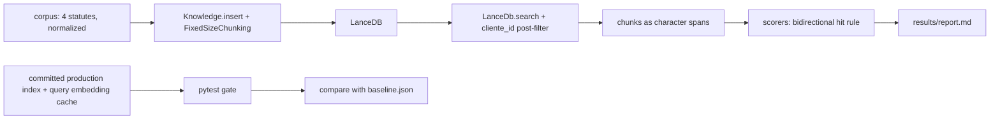
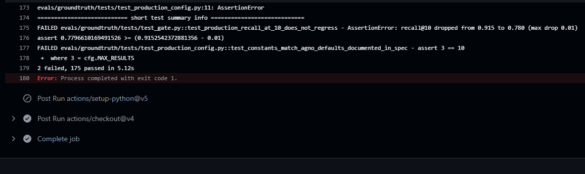
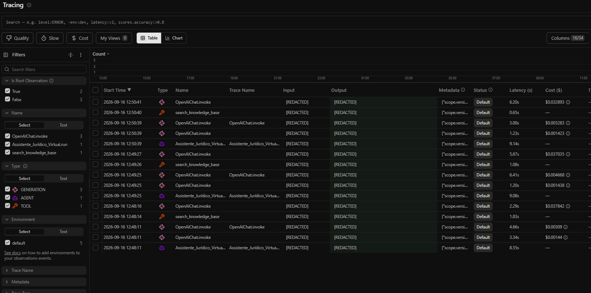
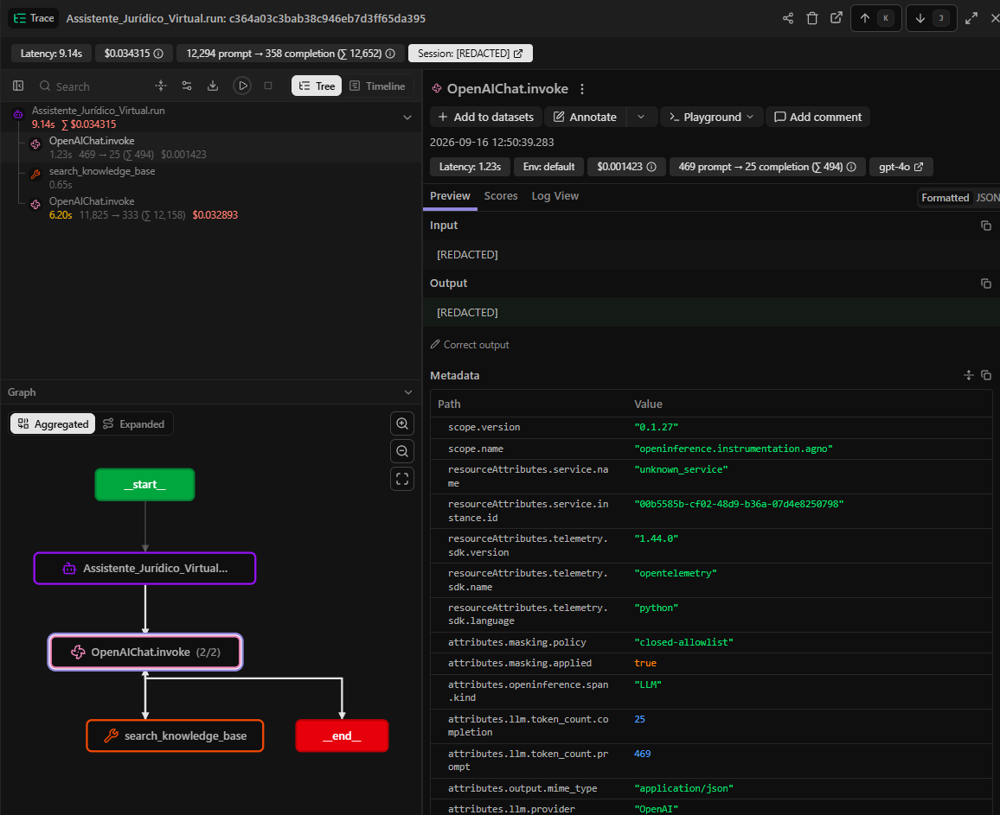

# Groundtruth

**English version:** [README.md](README.md)

Avaliação de retrieval e de geração do RAG do JuriAI sobre 4 leis brasileiras públicas e 59 perguntas selecionadas por consenso de dois modelos. A produção adotou o vencedor medido dessa comparação, o chunk1500, e hoje roda com recall@10 de 0.932 e mrr de 0.811 (`results/adoption.md`). As melhores configurações medidas chegam a recall@10 de 0.966 (busca híbrida e reranker, empatados).

## Resultados

### Retrieval

Cinco configurações rodam sobre as mesmas 59 perguntas do golden set.

**`production` em toda tabela e comparação abaixo é a configuração anterior à adoção, 5000/0.** Estas tabelas são a medição histórica que motivou a mudança e ficam como estavam; desde `results/adoption.md`, o `ia/retrieval_config.py` roda os parâmetros do `chunk1500`, 1500/150, então os números de produção hoje são os da linha `chunk1500`.

| config | chunk size/overlap | search type | reranker | n_chunks |
|---|---|---|---|---|
| production | 5000/0 | vector | none | 285 |
| chunk1500 | 1500/150 | vector | none | 1054 |
| chunk800 | 800/100 | vector | none | 2035 |
| hybrid | 1500/150 | hybrid | none | 1054 |
| rerank | 1500/150 | vector | bge-reranker-v2-m3 | 1054 |

Fonte: `results/notes.md`, seção 2.

Todas as 59 perguntas:

| config | recall@1 | recall@5 | recall@10 | mrr | ndcg@10 | p50 search ms |
|---|---|---|---|---|---|---|
| chunk1500 | 0.712 | 0.932 | 0.932 | 0.811 | 0.842 | 14 |
| chunk800 | 0.627 | 0.898 | 0.915 | 0.729 | 0.775 | 16 |
| hybrid | 0.695 | 0.949 | 0.966 | 0.806 | 0.847 | 17 |
| production | 0.373 | 0.864 | 0.915 | 0.594 | 0.675 | 12 |
| rerank | 0.881 | 0.966 | 0.966 | 0.921 | 0.933 | 45356 |

p50 search ms: tempo de relógio dentro de retriever.search, com o embedding da pergunta já calculado, na máquina que rodou; informativo, fora do gate.

Fonte: `results/report.md`.

subconjunto sem vazamento (spec): nenhum juiz classificou o vazamento como heavy e a maior sequência copiada tem menos de 5 tokens

| config | n | recall@1 | recall@5 | recall@10 | mrr | ndcg@10 |
|---|---|---|---|---|---|---|
| chunk1500 | 20 | 0.650 | 0.900 | 0.900 | 0.742 | 0.781 |
| chunk800 | 20 | 0.650 | 0.900 | 0.900 | 0.729 | 0.771 |
| hybrid | 20 | 0.500 | 0.900 | 0.900 | 0.667 | 0.726 |
| production | 20 | 0.400 | 0.750 | 0.750 | 0.575 | 0.621 |
| rerank | 20 | 0.750 | 0.900 | 0.900 | 0.817 | 0.838 |

Fonte: `results/report.md`.

subconjunto de cópia curta (visão de robustez): a maior sequência copiada tem menos de 5 tokens; os rótulos de vazamento dos juízes são ignorados

| config | n | recall@1 | recall@5 | recall@10 | mrr | ndcg@10 |
|---|---|---|---|---|---|---|
| chunk1500 | 49 | 0.694 | 0.918 | 0.918 | 0.793 | 0.825 |
| chunk800 | 49 | 0.612 | 0.898 | 0.918 | 0.720 | 0.769 |
| hybrid | 49 | 0.673 | 0.939 | 0.959 | 0.787 | 0.831 |
| production | 49 | 0.388 | 0.837 | 0.898 | 0.600 | 0.675 |
| rerank | 49 | 0.878 | 0.959 | 0.959 | 0.915 | 0.926 |

Fonte: `results/report.md`.

recall@10 por categoria

| config | conceito | fato_pontual | procedimento |
|---|---|---|---|
| chunk1500 | 0.818 (n=11) | 0.944 (n=18) | 0.967 (n=30) |
| chunk800 | 0.727 (n=11) | 0.944 (n=18) | 0.967 (n=30) |
| hybrid | 0.909 (n=11) | 0.944 (n=18) | 1.000 (n=30) |
| production | 0.909 (n=11) | 0.944 (n=18) | 0.900 (n=30) |
| rerank | 0.909 (n=11) | 0.944 (n=18) | 1.000 (n=30) |

Fonte: `results/report.md`.

No conjunto inteiro, rerank tem o maior recall@1 (0.881), recall@5 (0.966), MRR (0.921) e nDCG@10 (0.933), e empata com hybrid em recall@10 (0.966). No subconjunto sem vazamento, chunk1500, chunk800, hybrid e rerank empatam em recall@10 (0.900), todos acima de production (0.750). O ganho do reranker custa latência: o p50 de busca sobe de 14 ms para 45356 ms (ver [O que não funcionou, e achados](#o-que-não-funcionou-e-achados)). Fonte: `results/notes.md`, seções 3 e 5.

Ver `results/significance.md` para os intervalos de bootstrap e os testes pareados pré-registrados: os ganhos de recall@1 e MRR de chunk1500 sobre production são significativos após a correção de Holm (Holm p=0.0004 e 0.0010), mas o ganho de recall@10 não é (Holm p=1.0000); o ganho de recall@10 de hybrid sobre chunk1500 não é significativo (Holm p=1.0000); o ganho de MRR de rerank sobre chunk1500 é significativo (Holm p=0.0216), mas o ganho de recall@1 não é, após a correção de Holm (Holm p=0.0638).

### Geração

O agente JuriAI real (gpt-4o) respondeu a uma amostra de 30 perguntas do golden set (seed 7) e a 10 perguntas fora de escopo, com a config de retrieval 1500/150 adotada e com a instrução de abstenção da Task 20 no `JuriAI.INSTRUCTIONS`. Faithfulness e answer relevancy são pontuadas pelo DeepEval com gpt-4.1-mini como modelo juiz; a abstenção, pelo gpt-4.1 e pelo claude-haiku-4-5 juntos.

**Agora o agente se abstém em 10 de 10 perguntas fora de escopo.** Antes, com 5000/0 e sem instrução de abstenção, ele se absteve em 0 das 7 que concluiu e respondeu todas com conhecimento geral. O chunking e a instrução mudaram no mesmo passo, então nenhum dos dois resultados pode ser atribuído a um deles sozinho.

Antes e depois, lado a lado, com os tokens por turno e as contagens de métricas não pontuadas: `results/generation_adoption.md`. A medição anterior à adoção está preservada inteira em `results/generation_pre_adoption.md`, com `generation/answers_pre_adoption.jsonl` e `generation/scores_pre_adoption.json`.

| category | faithfulness mean | faithfulness n | relevancy mean | relevancy n |
|---|---|---|---|---|
| conceito | 0.960 | 7 | 0.969 | 8 |
| fato_pontual | 0.907 | 8 | 0.954 | 8 |
| procedimento | 0.946 | 13 | 0.983 | 14 |
| overall | 0.938 | 28 | 0.971 | 30 |

Sem retrieval, fora da média de faithfulness: 1. Execução com falha, fora das duas médias: 0. Não pontuada pelo juiz, fora da média de faithfulness: 1, porque um filtro de conteúdo recusou essa chamada de faithfulness. Contra os 0.952 (n=29) e 0.983 (n=30) anteriores à adoção, as duas médias caem um pouco; é uma passada de cada, sem repetição, então isso não é evidência de mudança de qualidade em nenhuma direção.

| label | contagem |
|---|---|
| abstained | 10 de 10 execuções concluídas |
| answered | 0 de 10 execuções concluídas |
| disagreement | 0 de 10 execuções concluídas |
| unverified | 0 de 10 execuções concluídas |
| run failed | 0 de 10 perguntas fora de escopo |

**Nenhuma execução falhou, e nenhum turno chegou perto do limite de taxa.** Os tokens de entrada por turno caíram de uma média de 15004.2 e um máximo de 40912 para uma média de 5479.8 e um máximo de 6257, contra um limite Tier 1 de 30,000 tokens de gpt-4o por minuto. Antes, 2 turnos concluídos e os 3 com falha estavam no limite ou acima dele, então um único turno conseguia esgotar o orçamento do minuto sozinho; depois, nenhum consegue. Quatro linhas falharam por limite de taxa transitório na primeira passada desta execução e foram refeitas com `--only`, que recusa qualquer id que não seja, no momento, uma execução com falha, então a amostra foi restaurada e não reescolhida.

**Uma pergunta dentro do escopo foi recusada**, a `r1-cdc-060`: o agente buscou, recuperou um contexto, e ainda assim disse que não encontrou nada na base de conhecimento. É 1 de 30, e as duas médias não detectam isso, porque o DeepEval deu 1.00 nessa recusa tanto em faithfulness quanto em relevancy, o que sobe as duas médias publicadas em vez de baixá-las: sem essa linha, faithfulness é 0.9358363858363858 sobre n=27 em vez de 0.9381279434850863 sobre n=28, e relevancy 0.9703359858532272 sobre n=29 em vez de 0.9713247863247862 sobre n=30. Desde a Task 21 um detector de frases offline mede os dois sentidos e as duas contagens são verificadas no CI: 1 recusa entre as 30 linhas do golden set e 10 abstenções detectadas entre as 10 linhas fora de escopo, estas concordando com os rótulos dos dois juízes em 10 de 10. O raciocínio completo está em `results/generation_adoption.md`, e as contagens e o que elas não veem em `results/abstention.md`.

Respostas que buscaram na base de conhecimento: 39 de 40. Custo medido da execução de geração: $0.8319 no total, contra $1.8735 antes, sem as chamadas de atualização de memória em segundo plano do agno e sem as chamadas de DeepEval feitas na primeira passada, que quebrou. Fonte: `results/generation.md`.

## Mudança adotada

**O chunk1500 dense é o que a produção roda agora.** O `ia/retrieval_config.py` define `CHUNK_SIZE = 1500` e `CHUNK_OVERLAP = 150`; nada mais mudou nesse módulo. Contra a configuração 5000/0 anterior à adoção, o chunk1500 eleva o recall@1 de 0.373 para 0.712 e o MRR de 0.594 para 0.811; `results/significance.md` acha as duas diferenças significativas após a correção de Holm (recall@1: b=23, c=3, Holm p=0.0004; diferença de MRR 0.216 [0.119, 0.314], Holm p=0.0010). O ganho de recall@10, de 0.915 para 0.932, não é significativo (b=3, c=2, Holm p=1.0000). Custa um pouco mais: o p50 de busca sobe de 12 ms para 14 ms, o índice cresce de 285 para 1054 chunks, e a ingestão sobe de 434515 para 483330 tokens ($0.00869 para $0.00967). Registro completo, com o novo baseline e o que esta mudança não mede: `results/adoption.md`. Fontes: `results/notes.md`, seções 2 e 4, e `results/significance.md`.

**Hybrid** é uma opção quando recall@10 importa mais que o primeiro resultado. Contra chunk1500, `results/significance.md` acha o ganho de recall@10 no conjunto inteiro (0.932 para 0.966, b=2, c=0) não significativo após a correção de Holm (Holm p=1.0000), e nem a mudança de recall@1 nem a de MRR é significativa. No subconjunto sem vazamento, hybrid reduz recall@1 (0.650 para 0.500) e MRR (0.742 para 0.667) em relação a chunk1500, embora nenhuma das duas quedas seja significativa em n=20 (Holm p=1.0000 e 0.8888).

**Rerank** tem os melhores números de ranking no conjunto inteiro (recall@1 0.881, MRR 0.921), e seu ganho de MRR sobre chunk1500 é significativo (diferença 0.110 [0.035, 0.192], Holm p=0.0216); seu ganho de recall@1 não é significativo após a correção de Holm (Holm p=0.0638). Não é candidato até que o recarregamento de modelo por chamada seja corrigido: o p50 de busca é 45356 ms, porque o agno 2.4.7 recarrega `BAAI/bge-reranker-v2-m3` do disco a cada chamada (ver [O que não funcionou, e achados](#o-que-não-funcionou-e-achados)).

**Custo de adoção, como foi pago.** O índice versionado e o `baseline.json` foram reconstruídos offline a partir do cache local de embeddings de chunk, sem nenhuma chamada de API. Com os documentos já armazenados é outra história: nenhum caminho de código reindexa uma linha de `Documentos` que já está no LanceDB (ver [O que não funcionou, e achados](#o-que-não-funcionou-e-achados)). O `render.yaml` de produção define `DATA_DIR=/tmp/juri-ai` (linhas 17 e 18), então o índice LanceDB vive em armazenamento efêmero e não sobrevive a um deploy ou a um restart.

**Ressalva de transferência.** A comparação rodou sobre 4 leis públicas, enquanto os documentos de produção são petições e contratos passados por OCR. O ganho é medido só neste corpus.

**A geração com o novo chunking agora está medida.** A Task 20 rodou de novo com 1500/150, junto com uma instrução de abstenção adicionada ao agente no mesmo passo: o `results/generation_adoption.md` tem o antes e o depois, e o `results/generation.md` é o relatório atual. O que continua não medido é cada uma das duas mudanças isoladamente, já que elas andaram juntas.

## Como funciona


```mermaid
flowchart LR
    A["corpus: 4 statutes, normalized"] --> B["Knowledge.insert + FixedSizeChunking"]
    B --> C["LanceDB"]
    C --> D["LanceDb.search + cliente_id post-filter"]
    D --> E["chunks as character spans"]
    E --> F["scorers: bidirectional hit rule"]
    F --> G["results/report.md"]
    H["committed production index + query embedding cache"] --> I["pytest gate"]
    I --> J["compare with baseline.json"]
```

O indexador (`indexer.py`) insere o corpus pelo mesmo caminho do agno que a produção usa. O retriever (`retriever.py`) chama o mesmo `LanceDb.search`, converte cada chunk retornado em um intervalo de caracteres `[start, end)` no texto normalizado da lei, e os scorers (`scorers.py`) comparam esses intervalos com as passagens do golden set.

## Golden set

### Como as 59 perguntas foram escolhidas

1. `golden/candidates.py` sorteou 80 artigos de lei (cpc 30, clt 25, cdc 15, lgpd 10) e pediu ao gpt-4.1-mini uma pergunta de advogado por artigo.
2. `golden/triage.py` calculou sinais determinísticos de vazamento e encontrou artigos concorrentes por dois métodos independentes do sistema medido: BM25 e text-embedding-3-large, top 5 de cada.
3. `golden/judges.py` rodou dois juízes de fornecedores diferentes, gpt-4.1 e claude-haiku-4-5, sobre as mesmas evidências com a rubrica v2. Cada juiz é cego ao outro e à categoria gravada.
4. `golden/consensus.py` só admite um candidato quando os dois juízes dizem que o artigo, sozinho, responde a pergunta por completo, nenhum juiz aponta um concorrente que responda por completo, a pergunta não cita fonte e os dois vereditos existem. A categoria é a maioria entre o gerador e os dois juízes. Vazamento nunca exclui; é registrado.

Candidatos: 80. Incluídos: 59. Excluídos: 21. Não houve revisão jurídica humana.

| motivo de exclusão | candidatos |
|---|---|
| also_answered_by | 16 |
| answerable | 4 |
| category_no_majority | 4 |
| cites_source | 1 |
| judge_missing | 2 |

Um candidato pode ter mais de um motivo.

| categoria | itens |
|---|---|
| conceito | 11 |
| fato_pontual | 18 |
| procedimento | 30 |

Subconjunto sem vazamento: 20 de 59 itens, em que nenhum juiz classificou o vazamento como heavy e a maior sequência copiada tem menos de 5 tokens.

Fonte: `results/golden_consensus.md`.

### Concordância entre os juízes

| campo | n | concordância | kappa de Cohen |
|---|---|---|---|
| answerable | 78 | 0.962 | 0.381 |
| also answered by any | 78 | 0.833 | 0.199 |
| leakage | 78 | 0.282 | -0.077 |
| category | 78 | 0.692 | 0.468 |

Fonte: `results/golden_consensus.md`.

Os juízes discordam sobre vazamento em nível pior que o acaso (kappa -0.077). Essa discordância é o motivo de reportar dois subconjuntos: o subconjunto sem vazamento usa os rótulos dos dois juízes, e o de cópia curta os ignora.

### Perguntas fora de escopo

A camada de geração também usa 10 perguntas fora de escopo. `generation/out_of_scope_check.py` mostra cada pergunta ao gpt-4.1 e ao claude-haiku-4-5 junto com a união dos seus artigos top 5 por BM25 e top 5 por text-embedding-3-large. Uma pergunta só conta como fora de escopo quando os dois juízes concordam que nenhum desses artigos contém qualquer parte da resposta. A primeira execução marcou oos-05 e oos-07 como respondíveis; essas duas perguntas foram substituídas, mantendo os ids, e a nova execução encontrou 10 de 10 fora de escopo. Fontes: `results/out_of_scope_check.md` e o commit `c452ab4`.

## Decisões de design

**(a) Passagens são intervalos de caracteres, não ids de chunk.** Uma passagem do golden set é um intervalo `[start, end)` no texto normalizado da lei, então qualquer chunking ou banco vetorial pode ser avaliado contra o mesmo golden set. O que custou: a regra de acerto original (um chunk precisa cobrir 50% da passagem) fazia com que um chunk menor que metade da passagem nunca acertasse. Por essa regra, chunk800 alcançava só 53 das 59 passagens do golden set, e 17 das 20 passagens sem vazamento. A regra passou a ser bidirecional antes da comparação de chunks: um chunk também acerta quando pelo menos 50% do chunk está dentro da passagem. As métricas de produção são idênticas nas duas regras. Fonte: `results/notes.md`, seção 1.

**(b) O CI roda offline.** O índice LanceDB de produção e o cache de embeddings das perguntas estão versionados, então o gate roda o caminho real de busca do agno sem chave de API. O que custou: qualquer mudança de chunking, embedder ou corpus deixa o índice versionado defasado, e o gate falha até alguém reconstruir o índice e o baseline localmente com `OPENAI_API_KEY` e versioná-los.

**(c) Scorers próprios no retrieval, DeepEval na geração.** recall@k, MRR e nDCG@10 são calculados por `scorers.py` sobre intervalos de caracteres. O DeepEval é usado só na camada de geração (faithfulness e answer relevancy).

**(d) Dois subconjuntos de vazamento.** O subconjunto sem vazamento segue a spec de design: nenhum juiz classificou o vazamento como heavy e a maior sequência copiada tem menos de 5 tokens. O subconjunto de cópia curta mantém só a condição da sequência copiada, como visão de robustez que não depende dos rótulos de vazamento dos juízes.

## O que não funcionou, e achados

- **5 perguntas têm recall@10 = 0 em production**; 3 delas são recuperadas por toda outra config, 2 não são recuperadas por nenhuma config. Fonte: `results/failures.md`.
  - `r1-clt-041` [procedimento] "Como é calculado o pagamento mensal dos professores com base nas aulas semanais e nas faltas?" CLT Art. 320, passagem com 562 caracteres. Causa não estabelecida. Recuperada por chunk1500 (posição 1), chunk800 (posição 2), hybrid (posição 1) e rerank (posição 1).
  - `r1-clt-044` [procedimento] "Os municípios podem criar regras que contrariem as normas e instruções federais sobre o funcionamento dessas atividades?" CLT Art. 69, passagem com 416 caracteres. Causa não estabelecida. Recuperada por chunk1500 (posição 4), chunk800 (posição 1), hybrid (posição 2) e rerank (posição 1).
  - `r1-cpc-000` [procedimento] "Quais são os requisitos para que a eleição de foro tenha validade em um contrato?" CPC Art. 63, passagem com 1361 caracteres. Causa não estabelecida. Recuperada por chunk1500 (posição 1), chunk800 (posição 1), hybrid (posição 2) e rerank (posição 1).
  - `r1-cpc-016` [conceito] "Quais são as defesas que podem ser apresentadas nesse tipo de processo?" A pergunta não tem antecedente para "esse tipo de processo". Na execução de geração o agente pediu esclarecimento sem buscar, e `results/generation_pre_adoption.md` conta isso como a única resposta sem retrieval. Não recuperada: falha em production, chunk1500, chunk800, hybrid e rerank.
  - `r1-cpc-004` [fato_pontual] "Quando a desistência da ação passa a ter efeito legal?" A passagem do golden set é o Art. 200 do CPC, cujo parágrafo único diz que a desistência só produz efeitos após homologação judicial. Nenhum dos 10 chunks que hybrid retorna se sobrepõe a essa passagem; 4 deles contêm a palavra "desistência" em outros dispositivos, entre eles os Arts. 485 e 1.040 do CPC. Não recuperada: falha em production, chunk1500, chunk800, hybrid e rerank.
- **O filtro `cliente_id` roda depois do top-k, e isso aparece.** O `LanceDb.search` do agno 2.4.7 pede ao LanceDB `limit` linhas e nada mais (`agno/vectordb/lancedb/lance_db.py:474-483`), e depois descarta em Python as linhas cujo `meta_data` não bate com o filtro (`lance_db.py:486-503`); expressões de filtro são recusadas com um aviso (`lance_db.py:467-469`). Medido numa tabela com dois clientes construída offline a partir do mesmo corpus e do chunking 5000/0 anterior à adoção (o cliente 0 tem cdc e clt, 149 chunks; o cliente 1 tem cpc e lgpd, 136 chunks; 285 no total), com `limit=10`. A mesma construção com o chunking 1500/150 adotado produz 1054 chunks; o `results/multitenant.md` não foi rodado de novo, porque o comportamento de filtro que ele documenta é uma propriedade do caminho de busca do agno, não do tamanho do chunk:
  - Buscando pelo cliente dono do documento da pergunta, 26 de 59 perguntas receberam menos de 10 linhas (12 de 28 no cliente 0, média de 8.54 linhas; 14 de 31 no cliente 1, média de 9.19) e nenhuma recebeu 0. O recall@10 não mudou: 0.929 e 0.903, o mesmo do índice de um único cliente nas mesmas perguntas.
  - Buscando pelo cliente que não é dono, as 59 receberam menos de 10 linhas e 33 receberam 0 (17 de 31 no cliente 0, 16 de 28 no cliente 1), embora cada cliente tenha mais de 130 chunks.
  - Linhas que alguma busca devolveu para o cliente errado: 0. O filtro não vazou dados entre clientes em nenhuma das 236 buscas (59 perguntas, os dois clientes, com e sem over-fetching).
  - O retriever do harness agora faz over-fetching: o `LanceDbRetriever` pede ao agno `k * OVERFETCH_FACTOR` linhas (fator 10), fica com as primeiras k que sobrevivem ao filtro e registra o que faltou (`last_shortfall`) em vez de tentar de novo. Com isso, o cliente dono recebeu 10 linhas nas 59 perguntas; a busca pelo cliente que não é dono recebeu 10 linhas nas 31 perguntas do cliente 0, e o cliente 1 ainda ficou abaixo de 10 em 10 de 28 (média de 8.18). Isso é uma mitigação no harness, não uma correção no app: `ia/` não mudou, e o over-fetching só reduz a chance de um resultado incompleto, porque um cliente com muito poucos dados ainda pode receber menos de k. Vale só para a busca vetorial pura; os caminhos hybrid e rerank mantêm a quantidade de candidatos, porque um corte maior muda a ordem deles, e os números de um único cliente em `results/report.md` não mudaram.
  - Um pré-filtro de verdade precisa de `cliente_id` como coluna que a busca vetorial possa filtrar. A tabela do agno tem só `vector`, `id` e `payload` (`lance_db.py:236-251`), com o `cliente_id` dentro da string JSON do `payload`, então isso exige uma mudança no agno ou um banco vetorial próprio.
  - O `Knowledge.insert` do agno captura um erro de embedding, registra no log e insere 0 chunks daquele documento (`agno/knowledge/knowledge.py:3899-3905`), então o build offline confere a quantidade de chunks de cada documento em vez de depender de uma exceção. Fonte: `results/multitenant.md`.
- **A busca full-text do hybrid não tem stemming em português.** Ela roda sobre a coluna `payload` com o FTS nativo do LanceDB no agno (`use_tantivy=False`). No subconjunto sem vazamento, hybrid reduz recall@1 (0.500 vs 0.650) e MRR (0.667 vs 0.742) em relação ao chunk1500 denso. Fonte: `results/notes.md`, seções 5 e 6.
- **O reranker recarrega o modelo a cada chamada.** O `SentenceTransformerReranker._rerank` do agno 2.4.7 constrói um novo `CrossEncoder` por chamada, então cada busca cronometrada do rerank inclui carregar `BAAI/bge-reranker-v2-m3` do disco. O p50 de busca é 45356 ms. Foi medido assim, sem patch. Fonte: `results/notes.md`, seção 7.
- **O mesmo reranker sem patch engole as próprias falhas, e uma linha publicada do rerank é busca vetorial pura.** O `Reranker.rerank` do agno 2.4.7 captura qualquer exceção de `_rerank`, registra o erro e devolve os candidatos na ordem de distância em que chegaram (`agno/knowledge/reranker/sentence_transformer.py:49-54`). Na execução de 2026-09-15 isso aconteceu com `r1-cdc-056`, a primeira das 59 perguntas, então a linha dela nas tabelas do `rerank` é busca vetorial pura, sem nada no artefato dizendo isso. Nenhum número publicado muda: essa pergunta pontua 1.000 em todas as métricas nas duas ordens, e seus 116305.2 ms foram a mais lenta das 59 latências de que o p50 de 45356 ms é a mediana. Forçar `_rerank` a lançar reproduz exatamente a lista de 2026-09-15, e deixá-lo funcionar reproduz a de hoje. O que varia entre reconstruções e o que não varia: reconstruir o índice 1500/150 offline a partir do corpus e do cache commitados reproduz a tabela commitada bit a bit em qualquer ordem de inserção, incluindo cada `_distance`, para todas as 59 perguntas até a profundidade 100; uma execução do `rerank` não reproduz, porque o fallback é silencioso e o harness não registra nada que o distinga. O gatilho daquela falha não está estabelecido. Fonte: `results/rerank_silent_fallback.md`.
- **O agente se absteve em 0 de 7 execuções fora de escopo concluídas**, com a config anterior à adoção e sem instrução de abstenção: ele respondeu todas com conhecimento geral. **Resolvido.** A Task 20 adicionou uma regra de abstenção ao `JuriAI.INSTRUCTIONS`, e a nova execução se abstém em 10 de 10. A correção trouxe o próprio modo de falha, a recusa excessiva dentro do escopo, que as duas médias publicadas dos juízes não enxergam; os dois sentidos agora são medidos offline e verificados no CI, 10 de 10 fora de escopo e 1 de 30 dentro do escopo. Fontes: `results/generation_pre_adoption.md`, `results/generation_adoption.md` e `results/abstention.md`.
- **3 de 10 execuções fora de escopo falharam por limite de taxa.** Um único turno do agente com a config de retrieval anterior à adoção (chunks de 5000 caracteres, 10 resultados por busca) pediu de 39229 a 40571 tokens, acima do limite de 30,000 tokens por minuto de gpt-4o de uma conta OpenAI Tier 1. **Medido e resolvido:** com 1500/150 o maior turno tem 6257 tokens de entrada, então nenhum turno sozinho esgota o orçamento do minuto, e a nova execução teve 0 execuções com falha. O que sobra é uma propriedade do harness, não do chunking: nada faz pacing de uma execução, então turnos consecutivos ainda podem acumular dentro de um minuto, que foi como 4 linhas falharam na primeira passada dessa nova execução antes de serem refeitas. Fontes: `results/generation_pre_adoption.md` e `results/generation_adoption.md`.
- **Nada reindexa um documento que já está no LanceDB.** Limitação conhecida, não corrigida nesta task. O `usuarios/signals.py:7-16` enfileira a chain de OCR e indexação só dentro do `if created:`, e o `ia/tasks.py:44-56` (`rag_documentos`) é o único que escreve na tabela `documentos`, tendo o `usuarios/signals.py:5` como único chamador. Não existe management command, ação de admin ou task agendada que reconstrua a tabela. Então, depois da mudança de chunking, a tabela mistura linhas 5000/0 escritas antes do deploy com linhas 1500/150 escritas depois. O que limita o estrago é que o `render.yaml`, nas linhas 17 e 18, define `DATA_DIR=/tmp/juri-ai`, armazenamento efêmero no plano free da Render, então a tabela é esvaziada a cada deploy, restart ou hibernação por inatividade, e só é preenchida de novo pelos documentos enviados depois disso. Fonte: `results/adoption.md`.
- **As primeiras execuções do CI falharam antes de qualquer job começar.** O workflow usava `${{ runner.temp }}` no `env` do job, onde o GitHub não permite o contexto `runner` ("Invalid workflow file: Unrecognized named-value: 'runner'"). O PR #11 corrigiu isso movendo `DATA_DIR` para o env do step de teste.
- **pandas era uma dependência não declarada.** Uma simulação do CI em venv limpo mostrou que a busca do `LanceDb` no agno 2.4.7 chama `to_pandas()`, enquanto o pandas só era instalado via docling, que a instalação do CI exclui. `pandas==2.3.3` agora está declarado em `requirements.txt`.

## Gate de regressão no CI

O workflow [`.github/workflows/groundtruth.yml`](../../.github/workflows/groundtruth.yml) roda em todo pull request, em push para main e por disparo manual. Ele instala as dependências da aplicação sem a stack de OCR mais `evals/groundtruth/requirements.txt`, e então roda `python -m pytest evals/groundtruth/tests -q -m "not needs_api"`, sem chave de API. Três testes em [`tests/test_gate.py`](tests/test_gate.py) formam o job `retrieval-gate`:

- `test_production_index_matches_current_retrieval_config`: o fingerprint do índice versionado precisa bater com a config de produção, que é 1500/150 desde o `results/adoption.md`.
- `test_production_recall_at_10_does_not_regress`: a config de produção roda offline sobre o golden set, e o recall@10 não pode cair mais de 0.01 abaixo de [`baseline.json`](baseline.json) (0.9322033898305084). Cache de perguntas defasado, índice defasado ou golden set com tamanho alterado também reprovam o teste, com o comando de reconstrução local na mensagem.
- `test_production_mrr_does_not_regress`: na mesma execução offline, compartilhada com o teste de recall@10, o mrr não pode cair mais de 0.02 abaixo de `baseline.json` (0.8107344632768362). A tolerância é maior que a do recall@10 porque uma única pergunta do golden set passando de acerto para erro já move o mrr em até 1/59 (cerca de 0.017); o gate existe para pegar regressões reais, não esse ruído. Um baseline escrito antes dessa chave existir reprova com uma mensagem nomeando o comando de reconstrução, não um `KeyError`.

O baseline era 0.9152542372881356 e 0.5944175410277106 com o chunking 5000/0. O gate agora cobra de produção os números mais altos.

Outros três testes de gate, em [`tests/test_abstention_gate.py`](tests/test_abstention_gate.py), seguram o comportamento de abstenção nos dois sentidos. Eles rodam o detector de frases offline [`generation/refusal.py`](generation/refusal.py) sobre o `generation/answers.jsonl` versionado e comparam as duas contagens com [`generation/abstention_baseline.json`](generation/abstention_baseline.json), que é um arquivo separado do `baseline.json` porque os dois gates reprovam por motivos diferentes:

- `test_out_of_scope_abstentions_do_not_regress`: abstenções detectadas entre as 10 linhas fora de escopo, baseline 10, e a tolerância é exata, então a contagem não pode cair nada. Espera-se que o agente se abstenha quando a base de conhecimento não cobre a pergunta.
- `test_golden_refusals_do_not_rise`: recusas entre as 30 linhas do golden set, baseline 1, e a tolerância é exata, então a contagem não pode subir nada. É o sentido para o qual as métricas publicadas são cegas: uma recusa não afirma nada, então o DeepEval deu à recusa de `r1-cdc-060` faithfulness 1.00 e relevancy 1.00, e um agente que recusa demais sobe as duas médias. A mensagem de falha aponta para `results/abstention.md`.
- `test_the_committed_answers_still_hold_the_run_the_baseline_was_taken_from`: os dois tamanhos de amostra, 30 e 10, precisam continuar batendo com o baseline, para que nenhuma contagem seja comparada contra outra execução.

As duas tolerâncias são exatas porque são contagens inteiras lidas de um único arquivo versionado, não de uma execução ao vivo: o mesmo arquivo dá os mesmos inteiros sempre, então não há ruído de medição a absorver, e uma linha é um passo grande nesse n, 10 pontos percentuais em 10 linhas e 3.3 em 30. Um baseline sem uma das chaves reprova com o comando de reconstrução na mensagem, não com um `KeyError`.

**O que esse gate é e o que não é.** Ele lê um artefato versionado produzido por uma execução paga, então pega uma mudança nesse registro, não uma mudança no comportamento ao vivo: editar o `JuriAI.INSTRUCTIONS` não reprova o CI até a execução de geração ser refeita e regravada em `generation/answers.jsonl`. Ele não protege o comportamento em produção. O detector também casa um conjunto pequeno de frases conhecidas em vez de entender a resposta, então uma recusa parafraseada escapa dele e as duas contagens são pisos: a contagem fora de escopo só pode estar baixa demais, e a de dentro do escopo também, que é o sentido que esconde a recusa excessiva. A rubrica de dois juízes em `generation/abstention.py` continua sendo a referência para abstenção fora de escopo; nessa execução o detector concorda com ela em 10 de 10 linhas. O `results/abstention.md` tem as contagens, a concordância e o que a métrica não vê.

**Demonstração.** O [PR #12](https://github.com/yagosamu/juri_ai/pull/12) mudou de propósito `MAX_RESULTS` de 10 para 3. O check falhou com 2 testes com falha e 175 aprovados: `test_production_recall_at_10_does_not_regress` com "recall@10 dropped from 0.915 to 0.780 (max drop 0.01)", e `test_production_config::test_constants_match_agno_defaults_documented_in_spec` com "assert 3 == 10". O PR foi fechado sem merge. A mesma mudança depois também reprovou `test_production_mrr_does_not_regress` com "mrr dropped from 0.594 to 0.568 (max drop 0.02)". Os números citados são o baseline anterior à adoção, contra o qual o gate comparava na época, e esse segundo teste foi renomeado desde então para `test_constants_match_the_adopted_production_configuration`.



**O que o gate não impede.** Um segundo workflow, [`.github/workflows/groundtruth-baseline-label.yml`](../../.github/workflows/groundtruth-baseline-label.yml), roda o job `baseline-change` em todo pull request e de novo sempre que um rótulo é adicionado ou removido, e reprova quando um caminho protegido (`baseline.json`, `golden/golden_set.jsonl`, `indexes/**`, `cache/queries/**`, `generation/answers.jsonl` ou `generation/abstention_baseline.json`) mudou sem o rótulo `baseline-change`, nomeando os arquivos alterados e pedindo que um mantenedor revise os números antes de adicionar o rótulo. Então um PR que edita `baseline.json` junto com uma regressão, que muda o golden set e o baseline juntos, ou que regrava a execução de geração de onde saem as contagens de abstenção, agora reprova a menos que um mantenedor adicione esse rótulo. Em um repositório com um único mantenedor isso é um obstáculo, não um controle de autorização: a mesma pessoa que propõe a mudança também pode adicionar o rótulo, então isso só garante um segundo olhar deliberado, não uma revisão por outra pessoa. Na recuperação o gate ainda verifica só o recall@10 e o mrr da config de produção; recall@1, nDCG e as outras configs não são verificados. Na geração ele verifica só as duas contagens de abstenção; faithfulness e relevancy são reportados mas não verificados, e as duas contagens são lidas de um artefato versionado em vez de medidas ao vivo.

## Observabilidade





Traces do Langfuse de respostas reais do JuriAI, da execução do Groundtruth em 2026-09-16. O conteúdo de prompt e resposta é redigido pelo hook de masking de produção.

O tracing de produção (`ia/observability.py`, chamado por `ensure_agno_tracing()` em `ia/views.py`) foi ligado para 3 perguntas do golden set: r1-clt-045, r1-cdc-062 e r1-lgpd-071.

- Cada execução do agente apareceu como um trace `Assistente_Jurídico_Virtual.run` com um span de agente, uma chamada pequena ao gpt-4o que decide buscar (cerca de 470 tokens de entrada), o span da ferramenta `search_knowledge_base`, e uma chamada de resposta ao gpt-4o com o contexto recuperado (11,825 a 14,833 tokens de entrada).
- A latência foi de 8.55 a 9.14 s por execução. O custo calculado pelo Langfuse foi de $0.0343 a $0.0393 por execução.
- As chamadas de atualização de memória em segundo plano do agno apareceram como traces `OpenAIChat.invoke` separados, com cerca de 900 tokens de entrada, custando de $0.0031 a $0.0047 cada. O Langfuse mostra essas chamadas, que o `run.metrics` não mede, por isso o custo medido em `results/generation_pre_adoption.md` não as inclui.
- Toda entrada e saída de trace e de observação mostra `[REDACTED]`, efeito do hook de masking por allowlist fechada.

## Como reproduzir

Rode todos os comandos a partir da raiz do repositório. Os comandos vêm da docstring e da definição de argparse de cada módulo.

### Instalação

```bash
pip install -r requirements.txt -r evals/groundtruth/requirements.txt
pip install -r evals/groundtruth/requirements-local.txt   # local only: sentence-transformers, deepeval, anthropic
```

O CI instala `requirements.txt` sem `docling` e `mpire`, mais `evals/groundtruth/requirements.txt`. O DeepEval roda com `DEEPEVAL_TELEMETRY_OPT_OUT=1`, que `generation/scoring.py` define antes de importá-lo.

### Variáveis de ambiente

- `OPENAI_API_KEY`: embeddings, geração de perguntas, juiz gpt-4.1, o agente e o DeepEval.
- `ANTHROPIC_API_KEY`: o juiz claude-haiku-4-5.
- Opcionais, para tracing no Langfuse: `LANGFUSE_ENABLED`, `LANGFUSE_PUBLIC_KEY`, `LANGFUSE_SECRET_KEY`, `LANGFUSE_BASE_URL`.

### Comandos

"API paga" marca os comandos que chamam a OpenAI ou a Anthropic.

| etapa | comando | API paga |
|---|---|---|
| Corpus: baixar do Planalto e normalizar | `.venv/Scripts/python.exe -m evals.groundtruth.corpus.build_corpus` | não |
| Corpus: normalizar a partir de `corpus/raw` sem baixar | `.venv/Scripts/python.exe -m evals.groundtruth.corpus.build_corpus --from-raw` | não |
| Índice: production (versionado; reconstruir só após mudança de config ou de corpus) | `.venv/Scripts/python.exe -m evals.groundtruth.indexer --config production` | sim, embeddings |
| Índice: configs de comparação (production, chunk1500, hybrid e rerank reusam um índice só) | `.venv/Scripts/python.exe -m evals.groundtruth.indexer --config chunk1500` e `--config chunk800` | sim, embeddings |
| Execução de retrieval a partir do cache de perguntas versionado | `.venv/Scripts/python.exe -m evals.groundtruth.run_retrieval --config production chunk1500 chunk800 hybrid rerank --offline` | não |
| Execução de retrieval e novo baseline | `.venv/Scripts/python.exe -m evals.groundtruth.run_retrieval --config production --write-baseline` | só se faltar pergunta no cache |
| Relatório | `.venv/Scripts/python.exe -m evals.groundtruth.report` | não |
| Gate e testes offline | `.venv/Scripts/python.exe -m pytest evals/groundtruth/tests -q -m "not needs_api"` | não |
| Golden set: candidatos | `.venv/Scripts/python.exe -m evals.groundtruth.golden.candidates --round 1` | sim, gpt-4.1-mini |
| Golden set: triagem | `.venv/Scripts/python.exe -m evals.groundtruth.golden.triage` (`--smoke`, `--limit N`, `--force`) | sim, gpt-4.1 e text-embedding-3-large |
| Golden set: recalcular as flags da triagem a partir dos vereditos gravados | `.venv/Scripts/python.exe -m evals.groundtruth.golden.triage --rederive-flags` | não |
| Golden set: juízes | `.venv/Scripts/python.exe -m evals.groundtruth.golden.judges` (`--smoke`, `--limit N`) | sim, gpt-4.1 e claude-haiku-4-5 |
| Golden set: consenso | `.venv/Scripts/python.exe -m evals.groundtruth.golden.consensus` | não |
| Verificação das perguntas fora de escopo | `.venv/Scripts/python.exe -m evals.groundtruth.generation.out_of_scope_check` | sim, text-embedding-3-large, gpt-4.1 e claude-haiku-4-5 |
| Geração: execução smoke, uma pergunta de cada tipo, gravada só em `runtime/generation` | `.venv/Scripts/python.exe -m evals.groundtruth.generation.run_generation --smoke --limit-golden 1 --limit-oos 1` | sim |
| Geração: execução completa | `.venv/Scripts/python.exe -m evals.groundtruth.generation.run_generation` | sim, gpt-4o, gpt-4.1-mini, gpt-4.1 e claude-haiku-4-5 |
| Geração: redesenhar `results/generation.md` a partir dos veredictos que já estão em `generation/scores.json` | `.venv/Scripts/python.exe -m evals.groundtruth.generation.run_generation --report-only` | não |
| Geração: pontuar as respostas que já estão em `generation/answers.jsonl` e redesenhar o relatório | `.venv/Scripts/python.exe -m evals.groundtruth.generation.run_generation --score-only` | sim, gpt-4.1-mini, gpt-4.1 e claude-haiku-4-5 |
| Geração: refazer só as execuções com falha | `.venv/Scripts/python.exe -m evals.groundtruth.generation.run_generation --only oos-01 oos-07 oos-08` | sim |
| Geração: recontar os dois números de abstenção a partir das respostas versionadas | `.venv/Scripts/python.exe -m evals.groundtruth.generation.refusal` | não |

Observações:
- Desde a adoção, `production` e `chunk1500` têm os mesmos parâmetros e o mesmo nome de índice, `c1500_o150_text-embedding-3-small_d1536`, então `--config production` e `--config chunk1500` constroem e leem a mesma tabela. A tabela 5000/0 continua versionada porque o `results/report.md` e o trabalho de múltiplos clientes ainda se referem a ela.
- A flag `--offline` do indexador falha quando falta embedding no cache, em vez de chamar a API. `cache/chunks` não é versionado, então uma reconstrução a partir de um clone limpo chama a API de embeddings.
- A config rerank baixa `BAAI/bge-reranker-v2-m3` do Hugging Face no primeiro uso.
- `--only` recusa qualquer id que não seja, no momento, uma execução com falha.
- Uma execução de geração só preenche a tabela `documentos` de runtime quando ela está vazia, e depois exige exatamente a contagem de chunks que o `ia/retrieval_config.py` atual produz sobre o corpus (1054 com 1500/150, 285 com o 5000/0 anterior à adoção). Depois de mudar o chunking, apague `runtime/generation/lancedb/documentos.lance` antes, senão a execução para nessa contagem antes de gastar qualquer coisa.
- O `--report-only` não faz chamada nenhuma, mas só redesenha veredictos que já estão em `generation/scores.json`. Ele não calcula nota nenhuma, e se recusa a rodar quando um veredicto gravado não tem `answer_sha256` para casar com as respostas em disco, então nunca publica os veredictos de uma execução como resultado de outra. Pontuar respostas que não têm veredicto gravado é o `--score-only`, que chama os três modelos juízes e custa dinheiro. Nenhum dos dois chama o agente, então nenhum dos dois muda uma resposta nem gasta tokens de agente.
- `golden/candidates.jsonl`, `golden/triage.jsonl`, `golden/judgments.jsonl` e `golden/golden_set.jsonl` são versionados, então triagem, juízes e consenso podem ser rodados de novo a partir de um clone, sobre os candidatos publicados. Gerar candidatos de novo chama o gpt-4.1-mini com temperature 0.7, então os novos candidatos seriam diferentes do conjunto publicado.
- `generation/answers.jsonl` e `generation/scores.json` não eram versionados até a Task 21 e agora são, porque o gate de abstenção lê as respostas e o job do rótulo `baseline-change` só consegue proteger um caminho versionado. Os arquivos foram versionados sem alteração: redesenhar o `results/generation.md` a partir deles produz o arquivo versionado byte por byte.

## Transparência

- O benchmark mede o pipeline publicado sobre um corpus público, não o tráfego do escritório.
- O golden set não tem revisão jurídica humana. Ele foi selecionado por consenso de dois juízes LLM, gpt-4.1 e claude-haiku-4-5.
- O conjunto de 59 perguntas está abaixo da meta de design de 100.
- A camada de geração usa uma amostra de 30 perguntas do golden set sorteada com seed 7, e os dois scorers dela são juízes LLM.
- O harness de geração não faz pacing nenhum: o `generate_answers` chama o agente em sequência, sem pausa e sem backoff, então a própria execução entra na janela de tokens por minuto da conta. É por isso que turnos de cerca de 5500 tokens ainda batem num limite de 30,000 por minuto, e significa que a contagem de execuções com falha de qualquer run de geração é uma propriedade desse pacing e do tier da conta, não do chunking que está sendo medido. Nenhum pacing foi adicionado.
- Os custos medidos estão em `results/notes.md` (ingestão) e `results/generation.md` (geração).
